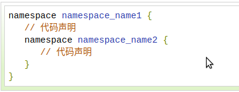
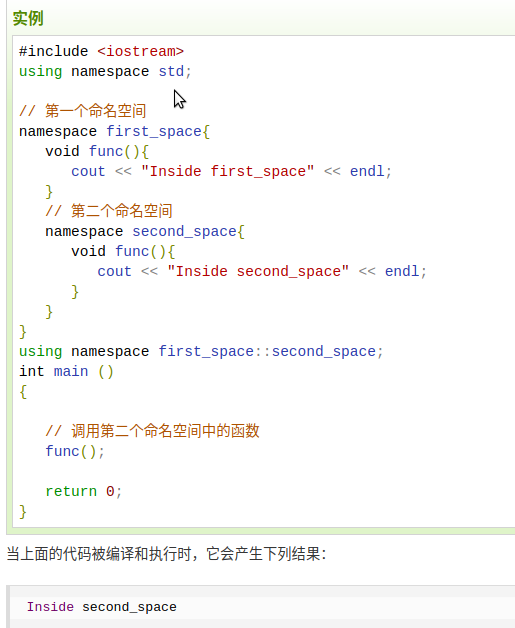
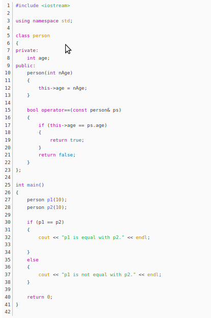
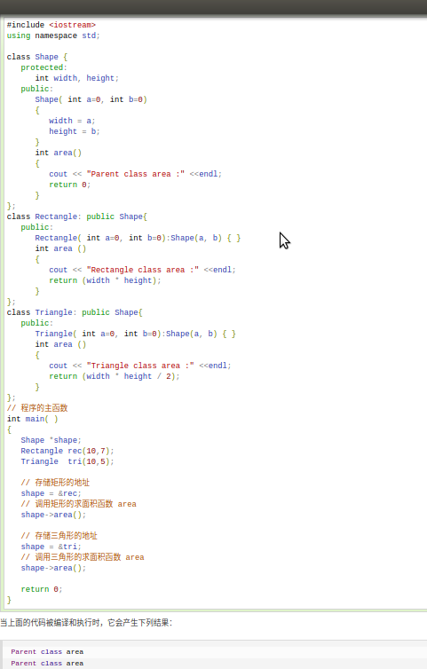
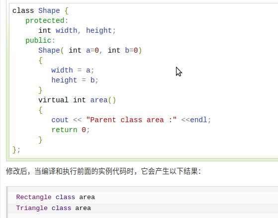
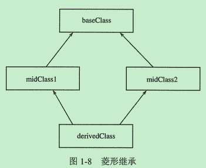
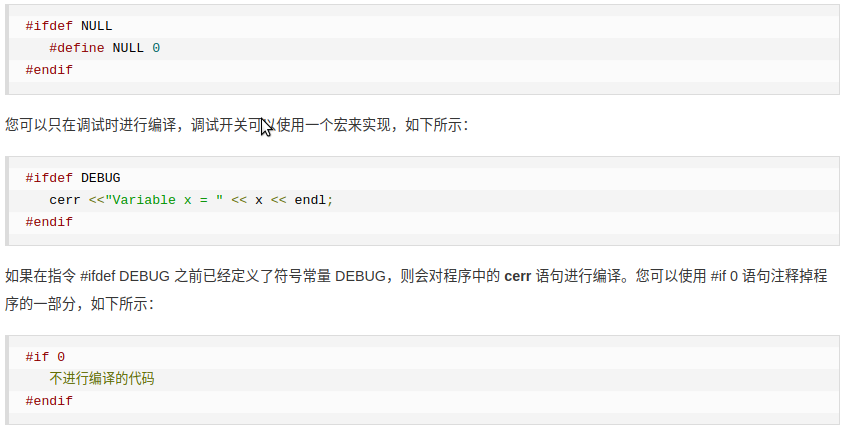
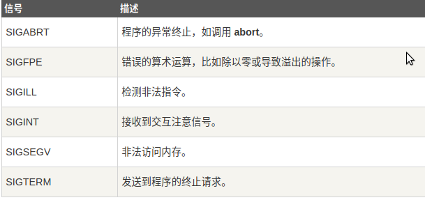
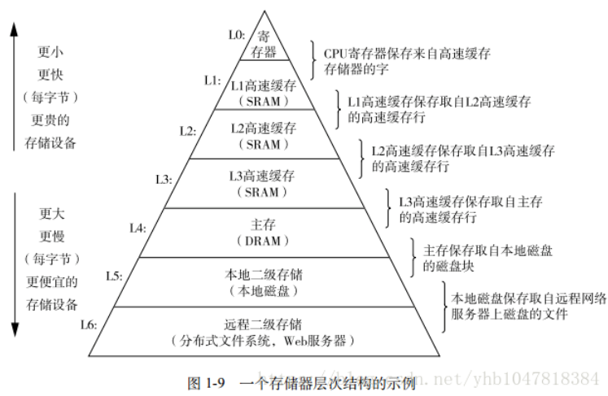
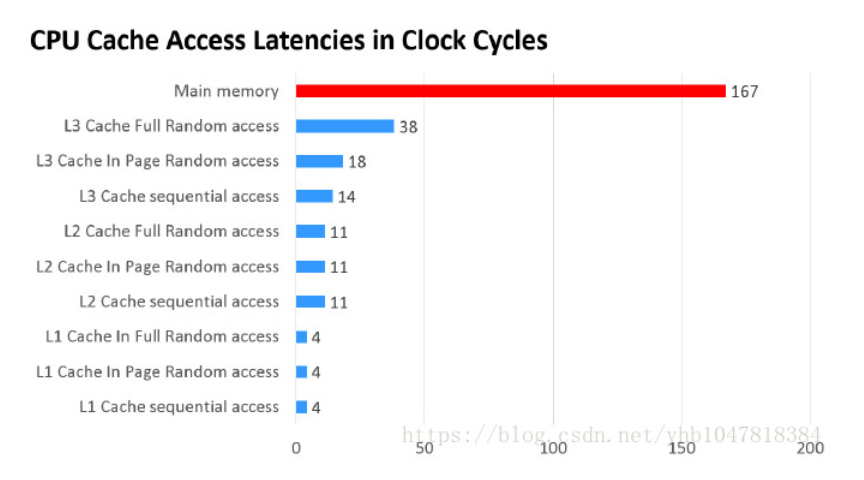

# C++基础-1

1. **\<cstdio>与<stdio.h>区别:**
   - stdio.h是C标准函数库中的头文件, stdio.h头文件将所有名字放在global namespace中.
   - cstdio是标准C++（STL）头文件, cstdio头文件将所有名字放在std namespace中.
2. **<>与" "区别:**
   - <>先去系统目录中找头文件，如果没有再到当前目录下找. 所以像标准的头文件 stdio.h和 stdlib.h等用这个方法.
   - " "首先在当前目录下寻找，如果找不到，再到系统目录中寻找. 这个用于include自定义的头文件，让系统优先使用当前目录中定义的.
3. **namespace介绍:**
   - C语言中只有一个全局作用域.
   > - C语言中所有的全局标识符/函数共享一个作用域, 
   > - 标识符之间可能发生冲突.

   - C++中引入namespace概念,即命名空间.
   > - 命名空间将全局作用域分成不同作用域.
   > - 不同命名空间中的标识符/函数可以同名而不发生冲突.
   > - 命名空间可以嵌套.
   > - 全局作用域也叫作默认命名空间.

   - 嵌套的命名空间:
   
   

   using指令: 可以使用using namespace 指令告诉编译器后续代码正在使用那个命名空间中的标识符/函数.
4. **继承和派生类:**
   - 继承允许我们依据另一个类来定义一个类,这使得创建和维护一个应用程序变得更容易,也达到了重用代码功能和提高效率的效果.
   - 当创建一个类时,不需要重新编写成员变量和成员函数,只需要指定新建的类继承一个已有的类即可.这个已有的类称为基类, 新建的类称为派生类.
   例: 
      单继承:`class derived-class: public/protected/private base-class`  
      多继承: `class derived-class: public/protected/private base-class, public/protected/private base-class1`
   - 继承有三种继承类型:public, protected, private. 我们通常使用public.
     公有继承(public): 当一个类派生自公有基类时,基类的公有成员也是派生类的公有成员,基类的保护成员也是派生类的保护成员,基类的私有成员不能直接被派生类访问,但是可以通过调用基类的公有和保护成员来访问.
     保护继承(protected): 当一个类派生自保护基类时, 基类的公有和保护成员将称为派生类的保护成员.
     私有继承(private): 当一个类派生自私有基类时, 基类的公有和保护成员将成为派生类的私有成员.
5. **访问控制和继承:**
   **在没有继承的情况下，protected和private相同.**
    
6. **重载运算符和重载函数:**  
   - 当调用一个重载函数或重载运算符时，编译器通过所使用的参数类型与定义中的参数类型进行对比,决定选用最合适的定义,选择最合适的重载函数或重载运算符的过程称为**重载决策**.
   - 重载函数: 在同一作用域内,可以声明几个功能类似的同名函数,但是这些函数的形参(个数或类型或顺序)必须不同.
   - 重载运算符: 可以重新定义或重载C++内置的大部分运算符.
      > 重载的运算符是带有特殊名称的函数,函数名是由关键字operator和其后要重载运算符符号构成的,与其他函数一样,重载运算符有一个返回类型和一个参数列表.例:`Box operator+(const Box& b)`
    
   - 上图例子中中的 if (p1 == p2) 语句，相当于对象p1调用函数“operator==”，把对象p2作为一个参数传递给该函数，从而实现了两个对象的比较。
7. **多态和虚函数:**
   
   

   - 上图中导致输出错误的原因是调用函数area()被编译器设置为基类中的版本,这就是所谓的**静态多态**或**静态链接**-函数调用在程序执行前就已经设置好了,故也叫**早绑定**.
  
   

   - 上图中输出正确结果原因是area()函数会在每个子类中具有不同的实现.这就是**多态**的一般使用方式.
   - 虚函数: 是在基类中使用关键字virtual声明的函数. 在派生类中重新定义基类中定义的虚函数时, 会告诉编译器不要静态链接到该函数, 这种操作称为**动态链接**或**后期绑定**.
   - 纯虚函数: 在基类中定义虚函数，以便在派生类中重新定义该函数更好地适用于对象，但是您在基类中又不能对虚函数给出有意义的实现，这个时候就会用到纯虚函数。

   - **虚函数机制：每个含有虚函数的类都有各自的一张虚函数表VTABLE。每个派生类的VTABLE继承了它各个基类的VTABLE，如果基类VTABLE中包含某一项（虚函数的入口地址），则其派生类的VTABLE中也将包含同样的一项，但是两项的值可能不同。如果派生类中重载了该项对应的虚函数，则派生类VTABLE的该项指向重载后的虚函数，如果派生类中没有对该项对应的虚函数进行重新定义，则使用基类的这个虚函数地址。在创建含有虚函数的类的对象的时候，编译器会在每个对象的内存布局中增加一个vptr指针项，该指针指向本类的VTABLE。在通过基类对象的指针（设为bp）调用一个虚函数时，编译器生成的代码是先获取所指对象的vtb1指针，然后调用vtb1所指向类的VTABLE中的对应项（具体虚函数的入口地址）.**

    ```cpp
      // C++ program for function overriding 

      #include <bits/stdc++.h> 
      using namespace std; 

      class base 
      { 
      public: 
      virtual void print () 
      { cout<< "print base class" <<endl; } 

      void show () 
      { cout<< "show base class" <<endl; } 
      }; 

      class derived:public base 
      { 
      public: 
      void print () //print () is already virtual function in derived class, we could also declared as virtual void print () explicitly 
      { cout<< "print derived class" <<endl; } 

      void show () 
      { cout<< "show derived class" <<endl; } 
      }; 

      //main function 
      int main() 
      { 
      base *bptr; 
      derived d; 
      bptr = &d; 

      //virtual function, binded at runtime (Runtime polymorphism) 
      bptr->print(); 

      // Non-virtual function, binded at compile time 
      bptr->show(); 

      return 0; 
      } 

    ```

      > `virtual int area() = 0;` = 0 告诉编译器,函数没有主体, 是纯虚函数.
    当类声明中包含纯虚函数时，这个类就称为一个**抽象基类**, 抽象类不能创建对象.
    [抽象基类](https://mp.weixin.qq.com/s?__biz=MzI3MDQyMDE2OQ==&mid=2247483809&idx=1&sn=144348310332b6a5de32155a7b4318a6&chksm=ead01007dda79911218cc31d467f41635e28f909e22778e83b490cc842a476151ceeb6713c95&mpshare=1&scene=1&srcid=&sharer_sharetime=1592918136665&sharer_shareid=87c63c66f42a4150bca9a3d2a69b5061&exportkey=A7%2B%2Fuf0ZpqScS3kyQlBUPuM%3D&pass_ticket=R96mvFDYo82O%2Fc57eWjA4QoEvDw%2F%2BpQ1a7j09aliMQ1EM4LeBaECwTCGmavT3NOK#rd)

    

   - **多重继承:** 继承一个以上的基类, 多重继承容易产生的问题是菱形继承，带来的问题就是`derivedClass`和`baseClass`之间有两条通道，因此在构造`derivedClass`时会调用两次`baseClass`.解决这个问题的方法是采用虚继承——`virtual`继承. 
   [多重继承](https://mp.weixin.qq.com/s?__biz=MzI3MDQyMDE2OQ==&mid=2247483809&idx=1&sn=144348310332b6a5de32155a7b4318a6&chksm=ead01007dda79911218cc31d467f41635e28f909e22778e83b490cc842a476151ceeb6713c95&mpshare=1&scene=1&srcid=&sharer_sharetime=1592918136665&sharer_shareid=87c63c66f42a4150bca9a3d2a69b5061&exportkey=A7%2B%2Fuf0ZpqScS3kyQlBUPuM%3D&pass_ticket=R96mvFDYo82O%2Fc57eWjA4QoEvDw%2F%2BpQ1a7j09aliMQ1EM4LeBaECwTCGmavT3NOK#rd)

8. **数据抽象和数据封装:**
   - 数据抽象指只向外界提供关键信息,并隐藏实现细节.C++类为数据抽象提供了可能,其可以向外界提供用于操作的公有方法,外界实际上并不清楚类的内部实现.
   - 数据抽象和数据封装的好处:
     > 类的内部受到保护,不会因无意的用户级错误导致对象状态受损.
     > 类实现可能随着时间的推移而发生变化,以便对应不断变化的需求,或者应对那些要求不改变用户级代码的错误报告。
9.  **预处理器:**
    - 预处理器是一些指令,指示编译器在实际编译之前所需完成的预处理.
    - 所有的预处理器指令都是以(#)开头,只有空格符可以出现在预处理器之前,预处理器指令不是C++语言,所以它们不会以分号(;)结尾.
      > `#include`指令用于把头文件包含到源文件中.
    - #define预处理指令用于创建符号常量,该符号常量通常被称为**宏**.
      > 例: `#define PI 3.14159`
    - 参数宏:使用#define来定义一个带参数的宏.
      > 例: `#define MIN(a,b) (a < b ? a : b)`
    - 条件编译: 可以用来有选择的对部分程序源代码进行编译.
      
10. **信号处理:**
    - 信号是由操作系统传给进程的中断,会提前终止一个程序,可以通过ctrl+c产生中断.
    - 下表所列信号可以在程序中捕获:
      
    - C++信号处理库提供signal函数来捕获突发/中断事件.
      > 例: `signal(SIGINT, signalHandler);`  //捕获到ctrl+c中断时执行signalHandler函数.
    - raise()函数:其可以生成突发/中断信号.
      > 例: `raise( SIGINT);` // 可以产生一个与ctrl+c效果相同的一个中断.
11. **异常处理:**
    - C++异常是指在程序运行时发生的特殊情况,比如尝试除以零操作.
    - C++异常处理涉及到三个关键字:
      > throw: 当出现问题时,程序会抛出一个异常.
      > catch: 用于捕获异常,可以捕获C++标准内置的异常(定义在\<exception>中)),也可以自定义异常.
      > try: try块中放置可能抛出异常的代码,try块中的代码被称为**保护代码**.
12. **动态内存:**
    - C++程序中的内存分为两部分:
      > - 栈: 在函数内部声明的所有变量都占用栈内存.
      > - 堆: 用于动态内存分配.
    - 很多时候,我们无法提前预知需要多少内存来存储某个定义变量中的特定信息,所需内存的大小需要在运行时才能确定,这时就需要分配堆中的内存,使用new和delete运算符.
      > 例: `int *array=new int [m];`  //动态分配,数组长度为 m
13. **模板:**
    [模板讲解](https://blog.csdn.net/lms1008611/article/details/81985815)
    - 人们需要编写多个形式和功能都相似的函数或类, 于是C++引人了**函数模板**和**类模板**, 编译器从函数模板和类模板可以自动生成多个函数和类，避免了程序员的重复劳动.
      例: ./template/template.c
    * 函数模板:
    > 函数模板可以用来创建一个通用的函数，以支持多种不同的形参，避免重载函数的函数体重复设计.
    ```
      template<typename(或class) T>
      <返回类型><函数名>(参数表)
      {
        函数体
      }
    ```
14. **智能指针:**
    - 动态内存管理经常会出现两种问题: 一种是忘记释放内存, 会造成内存泄漏; 一种是尚有指针引用内存的情况下就释放了它, 就会产生引用非法内存的指针.
    - 为了更加容易（更加安全）的使用动态内存, 引入了智能指针的概念. 智能指针的行为类似常规指针, 重要的区别是它负责自动释放所指向的对象.
    - 智能指针分类:
      > unique_ptr: 持有对对象的独有权, 即unique_ptr不共享它所管理的对象(两个unique_ptr不能指向一个对象).
      > shared_ptr: 共享所有权的智能指针，允许多个指针指向同一个对象.
      > weak_ptr: 不控制所指向对象生存期的智能指针，它指向一个由shared_ptr管理的对象，将一个weak_ptr绑定到一个shared_ptr不会改变shared_ptr的引用计数。一旦最后一个指向对象的shared_ptr被销毁，对象就会被释放，即使有weak_ptr指向对象，对象还是会被释放.
15. **引用:**
    - 引用不是对象, 而是一个对象的一个别名.
    - 定义指针时编译器会自动分配内存, 而引用不会单独分配空间.
    - 指针作为参数时, 会拷贝指针作为参数, 由于指针指向的是一个对象, 因此在函数内可以实现对指针所指向对象的修改. 引用作为参数时, 实际是传递对象的本身因此不需要拷贝. 
16. **vector:**
    - vector将元素存储在连续内存空间中, 当添加的元素超过原先分配的内存大小时, 就需要重新申请空间, 并把原来的元素移到新的内存中. 通常vector实现通常会比空间需求分配更大的空间, 以避免在添加元素时频繁的重新分配空间并对数据进行移动.
17. **class**和**struct**: 本质没有区别(都可以定义类), 只是默认访问控制权限不同(class默认为private, struct默认为public)
18. **sizeof**: 其是操作符而不是函数, 结果为参数数据占用的空间大小而不是参数维数.
    **strlen**: 从参数所指向的内存开始往后计数, 直到内存中的内容为0(即'\0').
    **string**: 字符串是以'\0'结尾的字符数组.

    <table><tr><td bgcolor=AntiqueWhite>char *str3 = "hello";//最后有一个”隐形“的'\0'
    
    printf("test3 %lu %lu\n\n", sizeof(str3), strlen(str3)); //8 5
    注: str3并不是一个数组，而是一个字符指针, 因此sizeof(str3)为8, strlen还是从str3指向的地址开始，直到遇到’\0’，即得到长度5</td></tr></table>
    <table><tr><td bgcolor=AntiqueWhite> char str1[8] = "hello";
    
    printf("test1 %lu %lu\n\n", sizeof(str1), strlen(str1)); //8 5
    注: str1占用空间是8，而strlen仍然是5</td></tr></table>
    <table><tr><td bgcolor=AntiqueWhite> char str2[] = {'h','e','l','l','o'};
    
    printf("test2 %lu %lu\n\n", sizeof(str2), strlen(str2)); //5 10
    注: 在str2中没有看到'\0'，所以你可能看到的结果是10，也可能是另外一个莫名其妙的值，甚至可能导致程序崩溃</td></tr></table>
    <table><tr><td bgcolor=AntiqueWhite> char str4[] = "hello";
    
    testArr(str4);//8 5 
    注: 当数组作为参数时，实际上只是一个指针，所以用sizeof计算时，会得到8</td></tr></table>
    <table><tr><td bgcolor=AntiqueWhite> char str6[10] = {0};
    
    printf("test6 %lu %lu\n\n", sizeof(str6), strlen(str6)); //10 0
    注: sizeof结果为10，但是由于都是0，因此strlen得到长度位0</td></tr></table>
    <table><tr><td bgcolor=AntiqueWhite> char str7[5] = "hello";
    
    printf("test7 %lu %lu\n\n", sizeof(str7), strlen(str7)); //5 10
    注: sizeof结果是5，它没有空间容纳最后的’\0’, 因此导致strlen计算的结果和test2一样，可能会是任意值</td></tr></table>

19. **const用法:**
	参考资料[链接](https://www.jb51.net/article/118141.htm)
	1. 修饰常量:
	> * 基本原则: const 变量不可修改.
	2. const与指针:
	> const与指针的关系分为两种: 
	> * `const int* val`或`int const *val`: 可以改变指针指向，不能改变所指变量的值.
	> * `int* const val`: 不能改变指针指向，可以改变所指变量的值.
	> 总结: **左定值, 右定向**
    3. const修饰类对象:
	> * 基本原则: const修饰类对象时，其对象中的任何成员都不能被修改. const修饰的对象，该对象的任何非const成员函数都不能调用该对象，因为任何非const成员函数都会有修改成员变量的可能.
	4. const修饰类的成员变量
	> * 基本原则: const修饰的成员变量不能被修改，同时只能在初始化列表中被初始化，因为常量只能被初始化，不能被赋值.
	5. const修饰类的成员函数:
	> * 基本原则: 不能修改对象中的成员变量, 也不能调用类中任何非const成员函数(因为调用非const成员函数可能会修改对象中的成员变量).

20. **const常量与define宏定义的区别:**
	1. 处理阶段不同:
	> define是在预处理阶段，define常量从未被编译器看见，因为在预处理阶段就已经替换了. 而const常量在编译阶段使用.
	2. 类型和安全检查不同:
	> define没有类型，不做任何检查，仅仅是字符替换，没有类型安全检查，并且在字符替换时可能会产生意料不到的错误. const常量有明确的类型，在编译阶段会进行类型检查.
	3. 存储方式不同:
	> define是字符替换，有多少地方使用，就会替换多少次，不会分配内存. 编译器通常不会为const常量分配空间，只是将它们保存在符号表内，使他们成为一个编译期间的一个常量，没有读取内存的操作，效率也很高.
	
21. **static作用:**
	参考资料[链接](https://www.jianshu.com/p/321afbde1b48)
	1. 全局静态变量: 
   	> * 在全局变量前加关键字static, 全局变量就定义成为一个全局静态变量.
	> * 内存中位置: 静态存储区(在整个程序运行期间一直存在)
	> * 初始化: 未经初始化的全局静态变量会被自动初始化为0(自动对象的值是任意值)
	> * 静态全局变量与普通全局变量的区别在于: 全局静态变量在声明他的文件之外是不可见的，准确地说是从定义之处开始，到文件结尾．其他文件中可以定义相同名字的变量，不会产生冲突. 
	> 例: 加了static关键字的全局变量只能在本文件中使用. 例如在a.c中定义了static int a=10;那么在b.c中用extern int a是拿不到a的值得，a的作用域只在a.c中.

    2. 局部静态变量: 
   	> * 在局部变量前加上关键字static, 局部变量就变成一个局部静态变量.
	> * 内存中位置: 静态存储区
	> * 初始化: 未经初始化的全局静态变量会被自动初始化为0(自动对象的值是任意值)
	> * 作用域: 作用域仍为局部作用域，当定义它的函数或语句块结束的时候，作用域结束．但是当局部静态变量离开作用域后并没有销毁，而是仍然驻留在内存当中，只不过我们不能再对它进行访问，直到该函数再次被调用，并且值不变．
 
    3. 静态函数: 
	> * 在函数返回类型前加关键字static, 函数就定义为静态函数. 函数的定义和声明在默认情况下都是extern的, 静态函数与普通函数不同，它只能在声明它的文件中可见，不能被其他文件所使用.
	> 定义静态函数的好处在于: 静态函数不能被其他文件使用, 其他文件中可以定义相同名字的函数，不会发生冲突.

	4. 类的静态成员:
	> * 相对于非静态数据成员(每个实例都会有一个数据成员的拷贝), 静态数据成员在程序中有且仅有一个拷贝, 由该类型的实例对象所共享. 也就是说，**静态数据成员是该类的所有对象共有的**. 
	> * 因为静态数据成员在全局区，属于类所有对象共享，所以，它不属于特定的实例，在没有产生类实例的作用域也可见，即在没有产生类实例时，我们就可以操作它.
	> * 与全局变量相比，静态数据成员具有两个优势: 第一，静态数据成员没有进入程序的全局命名空间，所以不存在与其他名字冲突的可能性，另外一点，静态数据成员可以是private成员，而全局变量不行，从这一方面说，静态数据成员维护了类的封装性.

	5. 类的静态函数:
	> * 与静态数据成员一样，我们可以为类创建静态成员函数，它为类的全部实例服务．
	> * 静态成员函数的this指针是缺省的，这很好理解，因为其并不属于某一个对象; 而普通成员函数一般都隐藏了一个指向自身的this指针.
	> * 因为静态成员函数的this指针是缺省的，所以其没办法访问类的非静态成员函数（联系this指针的作用），只能访问类的静态数据成员和静态成员函数.
	> * 因为静态成员函数的this指针是缺省的，所以不能将其定义为虚函数，因为虚函数表需要通过this指针访问。同理静态成员变量也无法使用虚函数.

	**注: 对一个类中成员变量和成员函数来说，加了static关键字，则此变量/函数就没有了this指针了，必须通过类名才能访问.**

22. **指针和引用的区别:**
	1. 指针有自己的一块空间, 而引用只是一个别名.
	2. 使用sizeof看一个指针大小为8(64为操作系统), 而引用则是被引用对象的大小.
	3. 指针可以被初始化为NULL, 而引用必须被初始化且必须是一个已有对象的引用.
	4. 作为参数传递时，指针需要被解引用才可以对对象进行操作，而直接对引用的修改都会改变引用所指向的对象.

23. **数组和链表的区别:**
	参考资料[链接](https://www.nowcoder.com/tutorial/93/2550f96bf7034399a3eb6dd3dafdce82)
	1. 数组: 
	> * 数组将元素在内存中连续存放, 可以通过下标快速访问数组中的任何元素. 数组在非末尾插入和删除数据效率低, 插入和删除数据时都会产生数据在内存中的移动和拷贝.
	2. 链表:
	> * 链表中的元素在内存中不是顺序存储的，而是通过存在元素中的指针联系到一起. 如果要访问链表中一个元素，需要从第一个元素开始，一直找到需要的元素位置. 但是增加和删除一个元素对于链表数据结构就非常简单了，只要修改元素中的指针就可以了. 

24. **C++内存管理:**
	参考资料[链接](https://www.jianshu.com/p/19771f5a89ea)
	1. 栈区(stack): 存放为运行时函数分配的局部变量、函数参数、返回数据、返回地址等. 函数执行结束后栈区自动释放. 栈内存分配效率高，由操作系统和编译器自动分配，但存储空间有限.
	2. 堆区(heap): 调用new/malloc函数时在堆区动态分配内存，同时需要调用delete/free来手动释放申请的内存, 否则可能会发生内存泄露和内存越界情况.
	3. 全局区(静态区): 存储程序的全局变量和静态变量.
	4. 常量区: 常量区内存空间存储常量（包括字符串等内容）.
	5. 代码区: 代码区存放函数体的二进制代码.

25. **静态链接库与动态链接库:**
    1. 当程序与静态库链接时，库中所有的目标文件都会被copy到可执行文件中，造成代码量增多. 而动态库是在运行时才将代码copy到内存中.
    2. 因为静态库是在编译的时候就已经完成copy，所以运行速度快，而动态库是在运行的时候才拷贝需要的函数，所以运行速度慢（可以理解为静态库是以空间换了时间）.
    3. 动态库是被多个程序共享，而静态库是每个程序拥有自己的一份copy.
    4. 如果需要对程序中的库进行修改和优化，使用动态库只需要重新将库编译即可；而使用静态库则需要将依赖静态库的文件都重新编译.

26. **inline函数的作用:**
	1. 优点: 指定为内联函数避免频繁调用消耗大量的栈空间。将函数指定为inline，就是在其调用位置展开，从而能对提高运行效率(不用再去寻找函数的实现).
	2. 缺点: 在调用位置展开从而也决定了内联函数的缺点，增大了代码量，从而消耗了内存空间.

27. **extern关键字的作用:**
	告诉编译器，这是一个全局变量或函数，如果在本文件中没有找到相应的变量或函数，可以在后面或其他文件中寻找.

28. **哪些情况下必须使用初始化列表:**
	1. 初始化类的成员有两种方式，一是使用初始化列表，二是在构造函数体内进行赋值操作. 使用初始化列表主要是基于性能问题.
	2. 常量成员，引用类型成员必须采用初始化列表形式，因为这两种成员只能初始化，不能赋值.
	3. 对于没有构造函数的类类型，因为使用初始化列表可以不必调用默认构造函数来完成初始化, 而直接调用拷贝构造函数初始化，这样是非常高效的.

29. **指针函数和函数指针:**
	1. 指针函数，简单的来说，就是一个返回指针的函数，其本质是一个函数，而该函数的返回值是一个指针.
	> 例: `int *fun(int x,int y)`
	2. 函数指针: 指向函数入口地址的指针. **指向函数的指针变量不是固定指向哪一个函数的，而只是表示定义了一个这样类型的变量，它是专门用来存放函数的入口地址的; 在程序中把哪一个函数的地址赋给它，它就指向哪一个函数**.
	> * 参考资料[链接1](https://www.jianshu.com/p/405a81d8e7b4)
	> * 参考资料[链接2](https://www.jianshu.com/p/6e858052b0f9)
	> * 格式: 类型名 (*指针变量名)(函数参数列表)
	> * 函数指针的用途: 调用函数和做函数的参数.

30. **#和##区别:**
	参考资料[链接](https://www.jianshu.com/p/595bd0d4eff3)
	> #: 预处理阶段进行替换.
	> ##: 将##前面与##后面的内容做连接，构成一个新的值，这个新的值不是一个字符串.

31. **单引号(')和双引号("):**
	> 单引号: 表明单个字符.
	> 双引号: 表示字符串.

32. **野指针:**
	> 1. 定义: 指向一个已删除的对象或未申请访问受限内存区域的指针.
	> 2. 产生原因: 
	> * 未初始化指针变量: 
	`int i = 3;`
	`int* p;`
	`*p=i;`  //野指针, p指向的内存访问受限. 因为指针未初始化，**指向的内存块是随机的**.
	> * 指针释放后之后未置空(悬空指针).
	`int i = 3;`
	`int* p = new int[3]`
	`delete [] a;`
	`*p = 3; `  // 野指针, p指向的内存访问受限. 此内存块已被delete释放.

33. **register关键字:**
	> 1. register关键字请求编译器将变量尽可能存储在CPU内部存储器中, 而不是通过内存寻址访问, 以提高效率. 
		注: 如果定义了很多register变量, 可能会超过CPU的寄存器个数, 超过容量, 因此是尽可能.
	> 2. register修饰的几点限制:
	> * register变量必须是能被CPU所接受的类型. 这通常意味着register变量必须是一个单个的值，并且长度应该小于或者等于整型的长度. 不过，有些机器的寄存器也能存放浮点数.
    > * 因为register变量可能不存放在内存中，所以不能用“&”来获取register变量的地址. 由于寄存器的数量有限，而且某些寄存器只能接受特定类型的数据（如指针和浮点数），因此真正起作用的register修饰符的数目和类型都依赖于运行程序的机器，而任何多余的register修饰符都将被编译程序所忽略. 在某些情况下，把变量保存在寄存器中反而会降低程序的运行速度. 因为被占用的寄存器不能再用于其它目的; 或者变量被使用的次数不够多，不足以装入和存储变量所带来的额外开销.
    > * 早期的C编译程序不会把变量保存在寄存器中，除非你命令它这样做，这时register修饰符是C语言的一种很有价值的补充. 然而，随着编译程序设计技术的进步，在决定那些变量应该被存到寄存器中时，现在的C编译环境能比程序员做出更好的决定. 实际上，许多编译程序都会忽略register修饰符，因为尽管它完全合法，但它仅仅是暗示而不是命令.
	> 3. **C++编译器有自己的优化方式，即使不使用register关键字编译器也会自动优化.**

34. **override关键字:**
	参考资料[链接](http://c.biancheng.net/view/1561.html)
	> override关键字告诉编译器, 该函数应该**覆盖**基类中的函数. 如果该函数实际上没有覆盖任何函数, 例如形参类型不同则无法覆盖, 则会导致编译器报错.

35. **STL--string类**
* C++ 从 C 继承的字符串概念仍然是以 '\0' 为结束符的 char 数组。
* 字符串中元素的访问可使用两种方法访问字符串中的单一字符：下标操作符[] 和成员函数at()，两者区别：
  > 1）下标操作符 [] 在使用时不检查索引的有效性
	> 2) 函数 at() 在使用时会检查下标是否有效。
* find() 函数和没有搜索到期望的字符（或子串），则返回 npos；若搜索成功，则返回搜索到的第 1 个字符或子串的位置

36. **STL--容器**
容器资料[链接](http://c.biancheng.net/stl/sequence_container/)
* array<T,N> (数组容器) ：是一个长度固定的序列，有 N 个 T 类型的对象，不能增加或删除元素。
* vector<T> (向量容器) ：是一个长度可变的序列，用来存放T类型的对象。必要时，可以自动增加容量，但只能在序列的末尾高效地增加或删除元素。
* deque<T> (双向队列容器) ：是一个长度可变的、可以自动增长的序列，在序列的两端都不能高效地增加或删除元素。
* list<T> (链表容器) 是一个长度可变的、由 T 类型对象组成的序列，它以双向链表的形式组织元素，在这个序列的任何地方都可以高效地增加或删除元素。访问容器中任意元素的速度要比前三种容器慢，这是因为 list<T> 必须从第一个元素或最后一个元素开始访问，需要沿着链表移动，直到到达想要的元素。
* forward list<T> (正向链表容器) ：是一个长度可变的、由 T 类型对象组成的序列，它以单链表的形式组织元素，是一类比链表容器快、更节省内存的容器，但是它内部的元素只能从第一个元素开始访问。

37. **STL--map容器**
**map容器资料[链接](http://c.biancheng.net/stl/map/)** ,map容器是一种关联容器，对象的位置取决于和它关联的键的值。
**map容器有四种：**
  > 1. map<K,T>: 保存pair<const K,T>类型的元素。map容器中的每个键值都是唯一的，不允许有重复的键值，可以进行一对一或者一对多的映射。map容器中的元素都是有序的，元素在容器中内的顺序是通过比较键确定的。
	> 2. multimap<K,T>:与map<K,T>容器类似，也会对元素排序。不通点在于multimap容器允许使用重复的键值。
	> 3. unordered_map<K,T>:其中的pair<const K,T>元素的顺序并不是由键值确定的，而是由键值的哈希表决定的。
	> 4. unordered_map<K,T>:也可以通过键值生成的哈希值来确定对象的位置，允许有重复的键值。

38. **map容器：**
- map<K,T>每个T类型的对象都有一个关联的K类型的键。容器内对象的位置是通过比较键决定的,map 使用 less<K> 对元素排序。
- STL map 容器对元素的组织方式并没有具体要求，但元素一般都会保存在一个平衡二叉树中。容器中的元素被组织成一个平衡二叉树，因而树的高度——根节点和叶节点之间的高度是最低的。如果每个节点的左子树和右子树的高度差不超过 1，那么可以说这棵二叉树就是平衡的。
- map<K，T> 中的每个元素都是同时封装了对象及其键的 pair<const K，T> 类型对象，这里不能修改 const K，否则会影响容器结构。
- map元素创建函数：
	> pair<const K,T>和make_pair:插入map中不存在的元素。例：std::pair<char,int>('a',100)
	> make_pair <T1,T2>()  例：std::make_pair("Ann",25)
- map插入元素函数：
  > 成员函数 insert():返回一个 pair<iterator,bool> 对象。对象的成员 first 是一个map<K,T>迭代器, 它要么指向插入元素，要么指向阻止插入的元素。如果 map 中已经保存了一个和这个键相同的对象，就会出现后面这种情况。这个对象的成员变量 second (布尔型)是返回对象，如果插入成功，返回值为 true，否则为 false。
- map获取元素函数：
  > 成员函数 at() 返回的是参数键对应的对象。如果这个键不存在，就会拋出 out_of_range 异常。
	> 成员函数 find() 可以返回一个元素的迭代器，这个元素的键值和对象匹配。
- map删除元素函数：
  > 成员函数erase(): 通过迭代器或键值删除元素
- map迭代器：
  > for (std::map<char,int>::iterator it=mymap.begin(); it!=mymap.end(); ++it)
				std::cout << it->first << " => " << it->second << '\n';

39. **emplace_back()取代push_back():**
> push_back()函数向容器中加入一个临时对象时，首先会调用构造函数生成这个对象，然后调用拷贝构造函数将这个对象放入容器中，最后释放临时对象。
> emplace_back()函数向容器中加入临时对象，临时对象原地构造，没有赋值或移动的操作。
**emplace()与insert():**
> 与上例相同
**综上：emplace_back()/emplace()相比push_back()/insert()最大的作用是避免了不必要的临时变量，因此执行速度快、效率更高。**

40. **virtual析构函数**:
> 定义一个父类的指针，指向子类对象，而在delete 父类指针时，期望释放对象。但父类析构函数不加Virtual修饰，则只会调用父类析构函数，而不调用子类析构函数，导致只释放了对象的父类部分，而子类部分没有释放.

41. **explicit关键字:**
> 主要是用来修饰类的构造函数，表明该构造函数是显式的，禁止单参数构造函数的隐式转换, 即如果c++类的其中一个构造函数有一个参数，那么在编译的时候就会有一个缺省的转换操作：将该构造函数对应数据类型的数据转换为该类对象。
[explicit讲解1](https://www.jb51.net/article/101557.htm)
[explicit讲解2](https://www.cnblogs.com/gklovexixi/p/5622681.html)

42. **C++类中的特殊成员函数:**
  六个函数特殊成员函数分别是：  
  * 默认构造函数:
    > 默认构造函数指不需要参数就能初始化的构造函数。包含无参和所有参数有默认值两种类型的构造函数。
  * 复制构造函数:
    > 复制构造函数用于将一个对象复制到新创建的对象中，它用于**利用一个同类对象初始化一个新创建的对象**.
    > 复制构造函数行参必须是`const reference`原因[链接](https://www.geeksforgeeks.org/copy-constructor-argument-const/)：
    ```cpp
          #include<iostream> 
          using namespace std; 
            
          class Test 
          { 
            /* Class data members */ 
          public: 
            Test(Test &t) { /* Copy data members from t*/} 
            Test()        { /* Initialize data members */ } 
          }; 
            
          Test fun() 
          { 
              cout << "fun() Called\n"; 
              Test t; 
              return t; 
          } 
            
          int main() 
          { 
              Test t1; 
              Test t2 = fun(); 
              return 0; 
          } 
          // error: cannot bind non-const lvalue reference of type ‘Test&’ to an rvalue of type ‘Test’  Test t2 = fun();
      ```

    > 默认复制构造函数的功能局限:默认的复制构造函数是逐个复制非静态成员的值. 这种复制操作是**浅拷贝**.因此在以下场景需要提供显式地复制构造函数.
    > - 类声明中包含静态成员变量
    > - 类成员是使用new分配动态内存来初始化的指向数据的指针

  * 赋值运算符:
    > 赋值运算符在将已有的对象赋给另一个对象的时候调用.
    > 默认的赋值运算符也是对成员进行逐个的值复制——**浅拷贝**.
  * 析构函数
  * 移动构造函数
    > C++11新增，该类的右值对象为参数的构造函数，其余同复制构造函数。
  * 移动复制运算符
    > 同复制赋值运算符，唯一不同是参数为右值。
  **C++11新增了=default和=delete函数修饰符，提示编译器使用默认或者删除默认的特殊函数。需要注意的是这两个修饰符只能修饰上述特殊函数.**
  [default讲解](https://mp.weixin.qq.com/s?__biz=MzI2OTA3NTk3Ng==&mid=2649284831&idx=1&sn=177853e985bb3d443b736e7f63152a9d&chksm=f2f993b8c58e1aae2f353beefa1dd30b50ec5ecde2e9f18a5af799286deb5a125305b5232b00&mpshare=1&scene=1&srcid=0326Mq0sWvh9bTYMTlZumlTn&sharer_sharetime=1585311683398&sharer_shareid=87c63c66f42a4150bca9a3d2a69b5061&exportkey=AxJXk5ZcW%2B1aJ7YUQJGB0%2BI%3D&pass_ticket=QGB2T9QUKj9%2FDBqTZFRux2fE2MBP33SOaQpnm2b6PMup%2BAIscHX8wNq7hY6vPvW%2F#rd)
  [特殊成员函数讲解](https://www.jb51.net/article/155953.htm)

43. **多进程和多线程:**
  * 基于进程的多任务处理是**程序的并发执行**.
  * 基于线程的多任务处理是同一**程序的片段的并发执行**.
  > 多线程程序包含可以同时运行的两个或多个部分。这样的程序中的每个部分称为一个线程，每个线程定义了一个单独的执行路径.
  > 多个线程访问同一资源时，为了保证数据的一致性，最简单的方式就是使用 mutex（互斥锁）.
  [互斥锁讲解](https://www.cnblogs.com/zhanghu52030/p/9166737.html)

44. **左值,右值和左值引用,右值引用:**
  [左,右值含义](https://www.jianshu.com/p/d19fc8447eaa)
  * C++11中可以取地址的、有名字的就是左值.
  * C++11中不能取地址的、没有名字的就是右值（将亡值或纯右值）.
  **区分左值和右值的便捷方法：看能不能对表达式取地址，如果能，则为左值，否则为右值.**

  * 左值引用就是对一个左值进行引用的类型. 右值引用就是对一个右值进行引用的类型.
  **左值引用只能绑定左值，右值引用只能绑定右值，如果绑定的不对，编译就会失败.**
  
  > 1. 左值引用， 使用 T&, 只能绑定左值
  > 2. 右值引用， 使用 T&&， 只能绑定右值
  > 3. 常量左值， 使用 const T&, 既可以绑定左值又可以绑定右值
  > 4. 已命名的右值引用，编译器会认为是个左值

45. **深浅拷贝:**
  [深浅拷贝含义1](https://www.jb51.net/article/120922.htm)
  [深浅拷贝含义2](https://www.yanbinghu.com/2020/01/05/12139.html)
  * 浅拷贝:指的是仅拷贝对象的所有成员，而不包括其引用对象（例如指针指向的内容）.
  * 深拷贝:除了拷贝其成员本身的值之外，还拷贝的成员指向的动态内存区域等类似的内容.

46. **static_cast:**
  * 用于基类和派生类之间指针或引用的转换
    > 上行转换（派生类转换为基类）是安全的.
    > 下行转换（基类转换为派生类）是不安全的(因为没有动态类型检查).
  * 基本类型数据之间的转换.
  * 空指针转换为目标类型的指针.
  * 任何类型转换为`void`类型.

  注意：static_cast不能转换掉expression的const、volatile、或者__unaligned属性

47. **dynamic_cast:**
  * 用于基类和派生类之间指针或引用的转换
    > 上行转换和下行转换都是安全的，还可以用于类之间的交叉转换.

48. **const_cast:**
  * `const_cast` 用于移除变量的`const`或者`volatile`限定符(只能进行指针、引用类型转换).

49. **reinterpret_cast:**
  * `reinterpret_cast`可以用来处理无关类型之间的转换.

50. **原码，反码和补码:**
  * 原码，反码和补码: [原码，反码和补码讲解](http://www.itheima.com/news/20200116/103436.html)
    - 原码: 原码就是符号位加上真值的绝对值，即用第一位表示符号，其余位表示值.
      > [+1]（原码） = 0000 0001
      > [-1]（原码） = 1000 0001
      > 原码是人脑最容易理解和计算的表示方式.
    - 反码: 正数的反码是其本身，负数的反码是在其原码的基础上，符号位不变，其余各个位取反.
      > [+1] = [00000001]（原码）= [00000001]（反码）
      > [-1] = [10000001]（原码）= [11111110]（反码）
      > 可见如果一个反码表示的是负数，人脑无法直观的看出来它的数值。通常要将其转换成原码再计算.
    - 补码: 正数的补码就是其本身，负数的补码是在其原码的基础上，符号位不变，其余各位取反，最后+1.
      > [+1] = [00000001]（原码） = [00000001]（反码） = [00000001]（补码）
      > [-1] = [10000001]（原码） = [11111110]（反码） = [11111111]（补码）
      > 对于负数，补码表示方式也是人脑无法直观看出其数值的。通常也需要转换成原码在计算其数值.

    * 补码做为计算机中二进制储存形式.
    * 补码产生原因: 在计算机中的数值运算归根截底都是加法运算, 原码和反码在计算减法运算时不能解决所有问题，因此补码恰好解决了所遇到的问题.[详见](http://www.itheima.com/news/20200116/103436.html)

51. **this:**
  * `this`指针是所有成员函数的**隐含参数**, 可以通过`this`指针访问对象的非静态函数和成员变量。
  [this 指针](http://c.biancheng.net/view/170.html)

52. **类成员初始化列表:**
  [Member Initializer List](https://www.geeksforgeeks.org/when-do-we-use-initializer-list-in-c/)
  [Member Initializer List Example](https://www.geeksforgeeks.org/output-of-c-program/)
  * 优先使用成员初始化列表而不是构造函数内赋值操作，因为成员初始化列表效率更高些.

53. **类的前置声明:** (详见`./design_pattern/adapter_pattern.cpp`) 
    [类的前置声明一](https://mp.weixin.qq.com/s?__biz=MzI3MDQyMDE2OQ==&mid=2247483747&idx=1&sn=f31b2047e10cc040b68005d30f11de41&chksm=ead010c5dda799d308303a3ca44b99cb5b618f3650abc50420cebf469eeb34e3ff87f5019e13&mpshare=1&scene=1&srcid=&sharer_sharetime=1592924309287&sharer_shareid=87c63c66f42a4150bca9a3d2a69b5061&exportkey=AwZ2A%2BZsNrCDwHN6uHs%2B6AQ%3D&pass_ticket=R96mvFDYo82O%2Fc57eWjA4QoEvDw%2F%2BpQ1a7j09aliMQ1EM4LeBaECwTCGmavT3NOK#rd)

    [类的前置声明二](https://mp.weixin.qq.com/s?__biz=MzI3MDQyMDE2OQ==&mid=2247483756&idx=1&sn=77b3877bdbe4f4e2cc80dd1d64dc10ec&chksm=ead010cadda799dc4ebeab07267235595bcbb2b1a4558b5694d1199bc2eec9b230d1ec42c0f3&mpshare=1&scene=1&srcid=&sharer_sharetime=1592960426181&sharer_shareid=87c63c66f42a4150bca9a3d2a69b5061&exportkey=A7ESpiU5x4cScY7UASjmL18%3D&pass_ticket=8lPzPI0TIY4zO2p8OJ6ssxZkPe4tS%2B5wv9IW0WvqUkJXLUSr0XKlxi64x2vY7qvS#rd)

    - 类的前置声明应用场景: 利用前置类型声明解决文件循环引用.
    - 类的前置声明使用: 使用前置类型声明只允许声明这个类型的指针和引用.
    - 通过解决头文件的循环引用问题，可以有以下启发:
      > 如果使用的仅仅是一个类的指针，没有使用这个类的具体对象（非指针), 也没有访问到类的具体成员，那么前置声明就可以了. 因为指针这一数据类型的大小是特定的，编译器可以获知.
      > 如果可以不包含头文件，那就不要包含, 尽量使用前置声明解决问题(因为前置类声明不能获得类的定义，因此当用到类的成员函数或成员变量时，需要通过包含头文件的方式获取类的定义，而前置类声明无法做到这点).
      > 尽量在CPP文件中包含头文件，而不要在头文件中包含.
    - 类的前置声明优点: 使用前置类型声明只允许声明这个类型的指针和引用, 由于指针类型的大小是固定的, 因此对于上述代码来说ClassInfo类的大小始终是固定的，不管Student类有多复杂, 因此前置类型声明极大的减小了类的大小.

54. **多线程:**
    ```cpp
    #include <iostream>
    #include <thread>

    void function_1() 
    {
      std::cout << "I'm function_1()" << std::endl;
    }

    int main() 
    {
      std::thread t1(function_1);
      // do other things
      t1.join();
      return 0;
    }
    ```
    - **同时声明的多线程运行的顺序不一定与定义相同.**

    - `join()`([join与detach](https://www.jianshu.com/p/5d273e4e3cbb)): 主线程会一直阻塞直到子线程执行完成, 即等待子线程结束后在结束主线程.
    - `detach()`: 将`t1`线程放在后台运行,所有权和控制权交给`C++`托管，以确保与线程相关的资源在线程退出后能被正确的回收. 这种被分离的线程被称为**守护线程（daemon threads）**, 线程分离后即使该线程的对象被析构，线程还是能够在后台运行的，只是主线程不能通过对象名与这个线程进行通讯.

    
    - **竞争条件(race condition)([竞争条件与互斥锁](https://www.jianshu.com/p/4a2578dd9b5d)):**最常见的就是**数据竞争(data race)**,即线程之间共享数据.
    - 使用互斥锁`std::mutex`进行资源保护, **`lock()`与`unlock()`**对资源进行上锁和解锁. 但是当`lock()`和`unlock()`之间的语句发生了异常，`unlock()`语句没有机会执行进而导致导致资源一直处于上锁状态.
    - `std::lock_guard`可以解决`unlock()`未执行导致资源一直上锁的情况. `lock_guard`在类的构造函数中创建资源，在析构函数中释放资源.
  
    
    - **死锁([死锁](https://www.jianshu.com/p/c01e992a3d9d)):**当某个`mutex`上锁后一直不释放，另一个线程访问该锁保护的资源的时候，就会发生死锁，这种情况下使用`lock_guard`就可以保证析构时能释放资源，但是当需要使用两个及以上互斥元的时候，仅仅使用`lock_guard`并不能保证不会发生死锁，因此避免死锁方法如下:
    > 1. 严格规定上锁的顺序，按照相同的顺序上锁
    > 2. 如果想同时对多个互斥锁上锁，要使用`std::lock(mutex1,mutex2)`对多个互斥锁同时上锁.

    
    - **`unique_lock`([unique_lock](https://www.jianshu.com/p/34d219380d90))**: `lock_guard`只能保证在构造和析构的时候执行上锁和解锁操作，而其本身并没有提供上锁和解锁的接口, 当需要分块上锁资源时, 则需要实例化多个`lock_guard`对象, 而`unique_lock`提供了`lock()`和`unlock()`接口，能记录现在处于上锁还是没上锁状态，在析构的时候，会根据当前状态来决定是否要进行解锁. 但是`unique_lock`的效率低于`lock_guard`.

    
    
    - **`condition_variable`([condition_variable1](https://www.jianshu.com/p/c1dfa1d40f53))([condition_variable2](https://www.bbsmax.com/A/KE5Q11ly5L/))**:其中`wait()`可以让线程进入**休眠状态**, 在生产消费模式时，当消费者发现队列中没有数据时，就可以通过`wait()`让自己休眠，通过`notify_one()`唤醒处于`wait()`中的条件变量（`condition_variable`）.
    ```cpp
        #include <thread>
        #include <iostream>
        #include <queue>
        #include <mutex>
        #include <condition_variable> 

        std::mutex mx;
        std::condition_variable cv;
        std::queue<int> q;
        bool finished = false;

        void producer(int n) 
        {
          for(int i=0; i<n; ++i) 
          {
            {
              std::lock_guard<std::mutex> lk(mx);
              q.push(i);
              std::cout << "pushing " << i << std::endl;
            }
            cv.notify_one();
          }
          {
            std::lock_guard<std::mutex> lk(mx);
            finished = true;
          }
          cv.notify_one();
        }

        void consumer() 
        {
          while (true) 
          {
            std::unique_lock<std::mutex> lk(mx);
            cv.wait(lk, []{ return finished || !q.empty(); }); // 此处加条件阻塞是为了防止可能由于系统的不确定原因唤醒(被称作伪唤醒)
            /*
            while (q.empty()) // 循环判断也可以避免伪唤醒
            {
              cv.wait(lk);   
            }
            */
            while (!q.empty()) 
            {
              std::cout << "consuming " << q.front() << std::endl;
              q.pop();
            }
            if (finished) break;
          }
        }

        int main() 
        {
          std::thread t1(producer, 10);
          std::thread t2(consumer);
          t1.join();
          t2.join();
          std::cout << "finished!" << std::endl;
        }
    ```

    - **future、promise、async、packaged_task:** 这几个模板函数均是为了使线程异步运行.
    ```cpp
    #include <iostream>
    #include <thread>

    void function_1(int& var)
    {
      std::this_thread::sleep_for(std::chrono::milliseconds(5000));
      var = var * 6;
    }

    int main()
    {
      int a = 4;
      std::thread t1(function_1, std::ref(a));
      std::cout << "return var a is : " << a << std::endl;
      t1.join();
      return 0;
    }
    ```
    通过如上代码可以得到结果: `return var a is : 4`, 结果并不是期望的`24`，原因是主线程没有等到子线程执行完成就获取参数`a`. 假如想要等子线程执行完在获取相应参数需要用如下实现:
    ```cpp
    #include <iostream>
    #include <thread>
    #include <future>

    int function_1(int var)
    {
      std::this_thread::sleep_for(std::chrono::milliseconds(5000));
      return var * 6;
    }

    int main()
    {
      int a = 4;
      std::future<int> fut = std::async(function_1, a);
      std::cout << "return var a is : " << fut.get() << std::endl;
      t1.join();
      return 0;
    }
    ```
    这样主线程就会在子线程执行完后再执行`cout`打印结果. `furture get()`函数会阻塞等待子线程执行完毕并得到反馈结果.

    ```cpp
    #include <iostream>       // std::cout
    #include <functional>     // std::ref
    #include <thread>         // std::thread
    #include <future>         // std::promise, std::future

    void print_int (std::future<int>& fut) {
      int x = fut.get();
      std::cout << "value: " << x << '\n';
    }

    int main ()
    {
      std::promise<int> prom;                      // create promise

      std::future<int> fut = prom.get_future();    // engagement with future

      std::thread th1 (print_int, std::ref(fut));  // send future to new thread

      prom.set_value (10);                         // fulfill promise
                                               // (synchronizes with getting the future)
      th1.join();
      return 0;
    }
    ```
    上述代码通过`promise`可以在子线程开始执行后在设置输入参数，子线程通过`get()`函数获取该输入参数，直到获取该参数后才会继续向后执行线程，否则会阻塞在这里.

    **`packaged_task`**([packaged_task讲解](https://blog.csdn.net/xiao3404/article/details/79541301))将一个普通的可调用函数对象转换为异步执行的任务，可以通过`thread`启动而不是`std::async`或者仿函数形式启动，其执行结果返回值或所抛异常被存储于能通过`std::future`对象访问的共享状态中.

    - **多线程对象调用几种方式:**
    ```cpp
    class A
    {
      public:
        void f(int x,char c){}
        int operator()(int n){return 0;}
    };

    void foo(int n) {return 0;}

    int main()
    {
      A a;
      std::thread t1(a, 6); //传递a的拷贝给子线程
      std::thread t2(std::ref(a), 6); //传递a的引用给子线程
      std::thread t3(std::move(a), 6); //a在主线程中将不再有效
      std::thread t4(A(), 6); //传递临时创建的A对象给子线程，伪函数方式
      std::thread t5(foo, 6);
      std::thread t6([](int x){return x*x;}, 6); //lambda方式
      std::thread t7(&A::f, a, 6,'w'); //传递a的拷贝的成员函数给子线程
      std::thread t8(&A::f, &a, 6,'w'); //传递a的地址的成员函数给子线程
    }
    ```

55. **设计模式**
    - **单例设计模式**: 在整个项目中，针对某一类只能创建一个对象.

56. **伪函数:**
    伪函数就是一个类重载`()`运算符， 这样类对象在使用`()`操作符时，看起来就像在调用一个函数.
    ```cpp 
    class Eat
    {
    public:
      void operator()()
      {
        cout << "eat food" << endl;
      }
    };

    Eat eat;
    eat(); // eat food
    ```

57. **引用作为返回值**
```cpp
  #include <iostream>
  #include <stdio.h>
  #include <vector>

  int temp;

  class TestCase 
  {
    public:
      TestCase() {}
      ~TestCase() {}
      int &operator()(int i, int j) 
      {
        printf("operator 1 \n");
        temp = i + j;
        // int temp1 = i + j;// reference to local variable ‘temp’ returned
        // return temp1;
        return temp;
      }
    };

  int main(int argc, char const *argv[]) 
  {
    /* code */
    TestCase test;
    int a = 1;
    int b = 2;
    printf("output1 is : %d\n", test(a, b));
    test(a, b) = 66;
    printf("temp is : %d\n", temp);
    return 0;
  }
```

如上程序重载`()`运算符并以`int&`作为返回值，`int&`返回值是一个左值变量(需要返回一个左值),当在`int &operator()(int i, int j)`中定义个局部变量`temp1`时，当函数生命周期结束后局部变量`temp1`销毁,则返回值将会发生`reference to local variable ‘temp’ returned`错误，因此当返回值为引用时需要定义个全局变量`temp`， 因为实例对象`test`返回是个`int&`左值，因此可以进行`test(a, b) = 66`赋值。

58. **模板**  
  模板有如下知识点：(详见`./template/template.cpp`)  
      [template](https://www.geeksforgeeks.org/templates-cpp/)
      * 函数模板
      * 类模板
      * 模板参数缺省
      * 传递non-type参数
      * 模板和静态变量
      * 模板元编程
      * 模板特殊化[Template Specialization](https://www.geeksforgeeks.org/template-specialization-c/)
      * 可变参数模板[variadic template](https://www.jb51.net/article/53749.htm)

59. **友元函数和友元类**  
    [友元](https://www.geeksforgeeks.org/friend-class-function-cpp/?ref=lbp)  
    被声明为友元的类或者函数可以访问类中的`protected`和`private`成员.
    ```cpp
      #include <iostream> 
      class A { 
      private: 
        int a; 

      public: 
        A() { a = 0; } 
        friend class B; // Friend Class 
      }; 

      class B { 
      private: 
        int b; 

      public: 
        void showA(A& x) 
        { 
          // Since B is friend of A, it can access 
          // private members of A 
          std::cout << "A::a=" << x.a; 
        } 
      }; 

      int main() 
      { 
        A a; 
        B b; 
        b.showA(a); 
        return 0; 
      } 

    ```
  
60. **memory reorder**
    
    * 简介：内存乱序在单线程下不容易出现问题，但是当在多线程无互斥保护下(无锁情况下)时，内存乱序影响容易出现。详细参见[memory reorder](http://dreamrunner.org/blog/2014/06/28/qian-tan-memory-reordering/)

    * 解决办法：
      > 显性compiler barriers: `asm volatile`阻止内存乱序
      > 隐性compiler barriers: 使用原子库`std::atomic` 

61. **cache Hit和cache Miss**   
    [cache Hit and Miss](https://www.cnblogs.com/jokerjason/p/10711022.html)  
    * Cache是用来对内存数据的缓存。
    * CPU要访问的数据在Cache中有缓存，称为“命中” (Hit)，反之则称为“缺失” (Miss)。
    * CPU访问它的速度介于寄存器与内存之间（数量级的差别）。Cache的成本介于寄存器与内存之间。
    * 典型的存储器层次结构:
           

    * CPU Cache Access latency:
           
         从延迟上看，做一次乘法一般只要三个周期，而做一次CPU的内存访问需要167个cycle，如果需要提升程序性能，减少CPU的memory访问至关重要。 

    * cache line: ache Line可以简单的理解为CPU Cache中的最小缓存单位。内存和高速缓存之间或高速缓存之间的数据移动不是以单个字节或甚至word完,成的。相反，移动的最小数据单位称为缓存行，有时称为缓存块目前主流的CPU Cache的Cache Line大小都是64Bytes。
    

62. **volatile:**
    * volatile: 对volatile修饰变量的访问，编译器不能做任何优化(假设和推理)，都必须按部就班地与「内存」进行交互, 避免内存乱序发生。
    > volatile只作用在编译器上，但我们的代码最终是要运行在CPU上的。尽管编译器不会换序，但CPU的乱序执行已是几十年的老技术了.

    * 终极解决乱序问题方法：
    > a. 使用原子操作`std::atomic<>`，它能构建了良好的内存屏障.  
    > b. 使用`mutex`互斥锁解决.

63. **atomic:**
    atomic: 原子类型是封装了一个值的类型，它的访问保证不会导致数据的竞争(不会发生内存乱序).

64. **NULL与nullptr**
    * `NULL`: 本质是0，是一个宏替换，没有类型.
    * `nullptr`:本质是0，表示空指针，但是具备了类型.

65. **constexpr**
    * `const`: 未区分出编译期常量和运行期常量.
    * `constexpr`: 限定在了编译期常量.
    > `constexpr`修饰的函数，简单的来说，如果其传入的参数可以在编译时期计算出来，那么这个函数就会产生编译时期的值。但是，传入的参数如果不能在编译时期计算出来，那么`constexpr`修饰的函数就和普通函数一样了.

66. **委托构造**
    * 委托构造[委托构造](https://blog.csdn.net/guang_jing/article/details/27121951): 委托构造函数使用它所属类的其他构造函数执行它自己的初始化过程, 提升代码复用性.

    ```cpp
      #include <iostream>
      using namespace std;
      class A
      {
      private:
        int i = 5;
        string str = "初始值";

      public:
        A()
        {
          str = "委托构造函数";
          i = 99;
        }
        A(int ii) : A()
        {
          //不能写成AA(int ii):A(),i(ii)
          //委托构造函数不能再利用初始化器初始化其他数据成员
          i = ii;
        }
        void show()
        {
          cout << "i=" << i << ",str=" << str << endl;
        }
      };
      int main()
      {
        A a(10);
        a.show();
      }
    ```
67. **继承构造**[链接](https://blog.csdn.net/K346K346/article/details/81703914)  
    * 子类为完成基类初始化，在C++11之前，需要在初始化列表调用基类的构造函数，从而完成构造函数的传递。如果基类拥有多个构造函数，那么子类也需要实现多个与基类构造函数对应的构造函数,这种方式无疑给开发人员带来麻烦，降低了编码效率.
    ```cpp
      class Base {
      public:
        Base(int v): _value(v), _c(0){}
        Base(char c): _value(0), _c(c){}
      private:
        int _value;
        char _c;
      };

      class Derived: public Base {
      public:
        // 初始化基类需要透传参数至基类的各个构造函数，非常麻烦
        Derived(int v) :Base(v) {}
        Derived(char c) :Base(c) {}

        // 假设派生类只是添加了一个普通的函数
        void display() {
          // dosomething		
        }
      };
    ```
    * 从 C++11 开始，推出了继承构造函数（Inheriting Constructor），使用 using 来声明继承基类的构造函数.
    ```cpp
      class Base {
      public:
        Base(int v) :_value(v), _c(0){printf("base construct one: %d %d\n",this->_value,this->_c);}
        Base(char c): _value(0), _c(c){printf("base construct two: %d %d\n",this->_value,this->_c);}
      private:
        int _value;
        char _c;
      };

      class Derived :public Base {
      public:
        // 使用继承构造函数
        using Base::Base;

        // 假设派生类只是添加了一个普通的函数
        void display() {
          //dosomething		
        }
      };

      int main(int argc, char const *argv[]) {
        Derived de(57);

        return 0;
      }
    ```

    * 注意：  
      > 继承构造函数无法初始化派生类数据成员, 继承构造函数的功能是初始化基类，对于派生类数据成员的初始化则无能为力.
      > 1. C++11 特性就地初始化成员变量，可以通过 =、{} 对非静态成员快速地就地初始化，以减少多个构造函数重复初始化变量的工作，注意初始化列表会覆盖就地初始化操作.
        ```cpp
          class Base {
          public:
            Base(int v) :value_(v), c_(0){printf("Base construct one: %d %d\n",this->value_,this->c_);}
            Base(char c): value_(0), c_(c){printf("Base construct two: %d %d\n",this->value_,this->c_);}
          private:
            int value_;
            char c_;
          };

          class Derived :public Base {
          public:
            // 使用继承构造函数
            using Base::Base;

            void display() {}

            private:
              double data_{7.3};
          };

          int main(int argc, char const *argv[]) {
            Derived de(12);
            return 0;
          }
        ```
      > 2. 新增派生类构造函数，使用构造函数初始化列表. 
      ```cpp
        class Base {
        public:
          Base(int v) :value_(v), c_(0){printf("Base construct one: %d %d\n",this->value_,this->c_);}
          Base(char c): value_(0), c_(c){printf("Base construct two: %d %d\n",this->value_,this->c_);}
        private:
          int value_;
          char c_;
        };

        class Derived :public Base {
        public:
          // 使用继承构造函数
          using Base::Base;

          Derived(int a, double b) : Base(a), data_(b) {printf("Derived construct one: %f \n",this->data_);}

          void display() {}

          private:
            double data_;
        };

        int main(int argc, char const *argv[]) {
          Derived de(12, 22.3);
          return 0;
        }
      ```

68. **final**
    `final`:指定某个类不能被其他类继承或某个虚函数不能被重写.
    ```cpp
      class Base
      {
      public:
        Base() {}
        virtual void func_foo() final{}
      };

      class Derived final :public Base {
      public:
        Derived(){}
        void func_foo(){}

      };

      class Derived1 :public Derived {
      public:
        Derived(){}
      };
    ``` 

    * 代码中的`Derived`类后的`final`表示`Derived`不能被其他类继承，`virtual void func_foo() final{}`中的`final`表示`func_foo()`函数不能被子类重写.

69. **lambda(匿名函数)**
    * 当某个函数仅应用一次并且不想单独命名时采用lambda表达式.
    * 语法：
      > [ capture clause ] (parameters) -> return-type  
      > {   
      >   definition of method   
      > } 

    * 按值捕获： 通过`[]`捕获的值在`lambda`内部是`const`类型的，想要修改需要`mutable`修饰`lambda`表达式，传入`lambda`内部的值不会影响`lambda`外的值.
      ```cpp
          int b = 6;
          auto f = [b](int in) { return b + in + 2; }(1); // f = 9  返回值

          int b1 = 12;
          auto f = [b1](int in,int in1) { return b1 + in+ in1 + 2; }(1,3); // f = 18  返回值

          int b2 = 5;
          auto f = [b2]() { return b2 + 2; }; // f() = 7  *****f()是该匿名函数的名字，可以通过f()方式调用匿名函数

          auto f = [](int a) { return a + 3; }; 
          f(5);// f() = 8  *****f()是该匿名函数的名字，可以通过f(5)方式调用匿名函数

          int b = 6;
          auto ret = [b]() mutable { return ++b; }; // ret = 7, b = 6  按值捕获
      ``` 

    * 按引用捕获：通过`[&变量]`捕获的值在`lambda`内部是可修改的，且传入`lambda`内部的值会同步影响`lambda`外的值.
      ```cpp
          int a = 9;
          auto f = [&a](){return ++a;}; // f()= 10, a = 10  按引用方式捕获 
      ```

    * `[=](){}`: 按值方式捕获所有变量.
    * `[&](){}`: 按引用方式捕获所有变量. 
  
    * 高阶用法：
    ```cpp
        std::vector<int> v1 = {3, 1, 7, 9};
        int N = 5;
        // below snippet find first number greater than N
        // [N]  denotes,   can access only N by value
        std::vector<int>::iterator p = std::find_if(v1.begin(), v1.end(), [N](int i) {
          return i > N;
        });

        std::cout << "First number greater than 5 is : " << *p << std::endl;  // First number greater than 5 is : 7

    ```

70. **函数包装器(functional)**
    * 匿名函数包装器:
      ```cpp 
      std::function<int(int)> f = [](int a) 
      {
        return a + 3;
      };

      std::cout << "output is : " << f(3)<<std::endl; // output is : 6
      ```

    * 普通函数包装器:
    ```cpp 
      double test(int a)
      {
        return  a * 6.5f;
      }

      std::function<double(int)> f = test;
      std::cout << "output is : " << f(3)<<std::endl; // output is : 19.5
    ```

    * 类成员函数
    ```cpp 
      class Test
      {
      public:
        double test(int a,int b)
        {
          return a * b * 1.0f;
        }
      };

      std::function<double(Test *, int, int)> f = &Test::test;
      Test t;
      std::cout << "output is :" << f(&t, 3, 5) << std::endl; // output is :15
    ```

    * 伪函数
    ```cpp
      class Test
      {
      public:
        double test(int a,int b)
        {
          return a * b * 1.0f;
        }

        int operator()(int a)
        {
          return a * 10;
        }
      };

      std::function<int(Test *, int)> f = &Test::operator();
      Test t;
      std::cout << "output is :" << f(&t,7) << std::endl; // output is :70
    ```

71. **bind机制**  
    * 主要在回调函数时应用，bind封装多余的参数返回带更少参数的函数，便于回调函数使用。 
    * 函数和参数的绑定
    ```cpp
      int add(int a, int b, int c)
      {
        std::cout << "input is : " << a << ", " << b << ", " << c << std::endl;
        return a + b + c;
      }

      auto foo = std::bind(add, 1, 2, 3);
      std::cout << "output is :" << foo() << std::endl; // input is : 1, 2, 3   output is :6
    ```

    ```cpp
      int add(int a, int b, int c)
      {
        std::cout << "input is : " << a << ", " << b << ", " << c << std::endl;
        return a + b + c;
      }

      auto foo = std::bind(add, std::placeholders::_2, 2,  std::placeholders::_1); // std::placeholders::_1 占位符
      std::cout << "output is :" << foo(9,7) << std::endl;  //input is : 7, 2, 9   output is :18
    ```

72. **RAII**
    * RAII(Resource Acquisition Is Intialization), 是C++的一种管理资源、避免泄漏的惯用法.
    * RAII的做法是使用一个对象，在其构造时获取对应的资源，在对象生命期内控制对资源的访问，使之始终保持有效，最后在对象析构的时候，释放构造时获取的资源

73. **空/野指针调用虚函数:**
```cpp
      #include <cstdio>
      #include <iostream>

      class Base
      {
      public:
          Base() = default;
          virtual ~Base() = default;

          void funcA()
          {
              printf("Base funcA\n");
          }

          virtual void funcB()
          {
              printf("Base funcB\n");
          }
      };

      int main()
      {
          Base base;
          base.funcA(); //Base funcA
          base.funcB(); //Base funcB

          Base *base1 = new Base();
          base1->funcA(); //Base funcA
          base1->funcB(); //Base funcB

          Base *base3 = nullptr;
          base3->funcA(); //Base funcA
          base3->funcB(); //Segmentation fault (core dumped)
      }
```  
**上面程序中导致出现`Segmentation fault (core dumped)`的原因如下：因为类的成员变量调用是通过指针偏移的方式进行的，又因为虚函数的调用机制是通过虚表指针和虚函数表来实现的，而虚表指针又是成员变量，而`Base *base3 = nullptr`中`base3`是一个空对象，所以在进行指针偏移时会出现程序崩溃。**

```cpp
      #include <cstdio>
      #include <iostream>

      class Base
      {
      public:
          Base() = default;
          virtual ~Base() = default;

          void funcA()
          {
              nums_ = 1;
              printf("Base funcA\n");
          }

          virtual void funcB()
          {
              printf("Base funcB\n");
          }
        
      private:
        int nums_;
      };

      int main()
      {
          Base base;
          base.funcA(); //Base funcAs
          base.funcB(); //Base funcB

          Base *base1 = new Base();
          base1->funcA(); //Base funcA
          base1->funcB(); //Base funcB

          Base *base3 = nullptr;
          base3->funcA(); //Segmentation fault (core dumped)
          base3->funcB(); //Segmentation fault (core dumped)
      }
```  
上面程序产生程序崩溃的实际原因和第一个程序相同。

74. **unique_ptr和shared_ptr实现原理：**   
[智能指针实现原理1](https://zhuanlan.zhihu.com/p/103903319)  
[智能指针实现原理2](https://www.jianshu.com/p/b6ac02d406a0)  
* `unique_ptr`: 对独占资源的管理，`unique_ptr`模板类中禁用了拷贝构造函数和拷贝赋值运算符重载，你无法拷贝unique_ptr指针，进而实现了独享资源的管理，但是`unique_ptr`模板类定义了移动语义，可以将资源管理权转移到另一个`unique_ptr`, 移交后，源指针指向的资源就不存在了.

* `shared_ptr`: 共享资源的管理，通过引用计数`use_count`来管理对象，当`shared_ptr`拷贝时会增加，当`shared_ptr`析构时会减少.

75. **指针传递混淆点：**
```cpp
    #include <cstdio>
    #include <iostream>
    #include <memory>

    void test(int *x)
    {
        printf("test before x address is : %p\n", x); //test before x address is : (nil)
        x = new int(6);
        printf("test after x address is : %p\n", x); //test after x address is : 0x560fe19be280
        printf("test after x value is : %d\n", *x); //test after x value is : 6
    }

    int main()
    {
        int *a = nullptr;
        printf("variable a address is : %p\n", a); //variable a address is : (nil)
        test(a);
        printf("variable a is : %d\n", *a); //Segmentation fault (core dumped)
    }
```
上面代码最终会发生`Segmentation fault (core dumped)`错误，产生原因是因为函数中参数都是值传递，而指针本质上也是传值. 可以采用如下两种修改错误：

```cpp
    #include <cstdio>
    #include <iostream>
    #include <memory>

    void test(int **x)
    {
        printf("test before x address is : %p\n", *x); //test before x address is : (nil)
        *x = new int(2);
        printf("test after x address is : %p\n", *x); //test after x address is : 0x558264bfa280
        printf("test after x value is : %d\n", **x); //test after x value is : 2
    }

    int main()
    {
        int *a = nullptr;
        printf("variable a address is : %p\n", a); //variable a address is : (nil)
        test(&a);
        printf("variable a is : %d\n", *a); //variable a is : 2
    }
```

```cpp
    #include <cstdio>
    #include <iostream>
    #include <memory>

    void test(int *x)
    {
        printf("test before x address is : %p\n", x); //test before x address is : 0x7ffdb6a76e84
        *x = 3;
        printf("test after x address is : %p\n", x); //test after x address is : 0x56544f7f2280
        printf("test after x value is : %d\n", *x); //test after x value is : 3
    }

    int main()
    {
        int a = 0;
        printf("variable a address is : %p\n", &a); //variable a address is : 0x7ffdb6a76e84
        test(&a);
        printf("variable a is : %d\n", a); //variable a is : 3
    }
```

76. **C++11、C++14、C++17**
  
    * C++14新特性：[链接](https://segmentfault.com/a/1190000023441427)
    > 1. 函数返回值类型推导
    > 2. lambda参数auto
    > 3. 变量模板
    > 4. 别名模板
    > 5. `std::make_unique`

    * C++17新特性：[链接1](https://www.geeksforgeeks.org/features-of-c17-with-examples/)  [链接2](https://blog.csdn.net/qq811299838/article/details/90371604?utm_medium=distribute.pc_relevant.none-task-blog-BlogCommendFromMachineLearnPai2-2.channel_param&depth_1-utm_source=distribute.pc_relevant.none-task-blog-BlogCommendFromMachineLearnPai2-2.channel_param#1.1%20constexpr)
    > 1. 嵌套命名空间的写法更新
    > 2. `if`和`switch`判断语句中可以声明和初始化变量
    > 3. 扩展`constexpr`使用范围，可用于`if`语句中，也可用于`lambda`表达式中
    > 4. 扩展`auto`的推断范围（`lambda`和模板参数及返回值的类型自动推倒）

77. 多态是通过虚表和虚表指针来实现，虚表指针存放在对象的最前端，而虚函数表是存放在可执行文件中（微软的编译器将虚函数表存放在了目标文件或者可执行文件的常量段中；gcc编译器的实现中虚函数表vtable存放在可执行文件的只读数据段.rodata中）
78. 在计算类的大小时，为什么只计算类的成员变量而不计算成员函数的大小？  
    [链接](https://blog.csdn.net/alidada_blog/article/details/81262152)  

79. **STL 容器**
    * 顺序容器：`vector`，`list(双向链表)`,`deque(双端队列)`
    > * 之所以被称为顺序容器，是因为元素在容器中的位置同元素的值无关，即容器不是排序的.  
    > * `vector<T>`（向量容器）：用来存放 T 类型的元素，是一个长度可变的序列容器，即在存储空间不足时，会自动申请更多的内存。使用此容器，在尾部增加或删除元素的效率最高（时间复杂度为 O(1) 常数阶），在其它位置插入或删除元素效率较差（时间复杂度为 O(n) 线性阶，其中 n 为容器中元素的个数）  
    > * `deque<T>`（双端队列容器）：和 vector 非常相似，区别在于使用该容器不仅尾部插入和删除元素高效，在头部插入或删除元素也同样高效，时间复杂度都是 O(1) 常数阶，但是在容器中某一位置处插入或删除元素，时间复杂度为 O(n) 线性阶.  
    > * `list<T>`（链表容器）：是一个长度可变的、由 T 类型元素组成的序列，它以双向链表的形式组织元素，在这个序列的任何地方都可以高效地增加或删除元素（时间复杂度都为常数阶 O(1)），但访问容器中任意元素的速度要比前三种容器慢，这是因为 list<T> 必须从第一个元素或最后一个元素开始访问，需要沿着链表移动，直到到达想要的元素。  
    * 关联容器：`set`、`multiset`、`map`、`multimap`
    > * 关联容器内的元素是排序的. 关联式容器在存储元素值的同时，还会为各元素额外再配备一个值（又称为“键”，其本质也是一个 C++ 基础数据类型或自定义类型的元素），它的功能是在使用关联式容器的过程中，如果已知目标元素的键的值，则直接通过该键就可以找到目标元素，而无需再通过遍历整个容器的方式四种容器的底层通过红黑树实现的.  
    > `set`:使用该容器存储的数据，**各个元素键和值完全相同**，且各个元素的值不能重复（保证了各元素键的唯一性）。该容器会自动根据各个元素的键（其实也就是元素值）的大小进行升序排序.  
    > `map`:使用该容器存储的数据，其各个元素的键必须是唯一的（即不能重复），该容器会根据各元素键的大小，默认进行升序排序.  
    * `stack`、`queue`、`priority_queue`
80. **移动语义(move semantic)和完美转发(perfect forwarding)[链接](https://mp.weixin.qq.com/s?__biz=MzIwNDgyMTEyMA==&mid=2247483912&idx=1&sn=e4f79f3260fc36b9525301b2f1bd0b7b&chksm=973b05e7a04c8cf149e2d1b7ff74785ab5b9011751b3270215428361ad168dd49594eb8ccf61&mpshare=1&scene=1&srcid=1127fLaEdraBHZ1WLt1frquE&sharer_sharetime=1606451995099&sharer_shareid=87c63c66f42a4150bca9a3d2a69b5061&exportkey=A%2FPKMZQ%2B3dGEoakdcYSAJGE%3D&pass_ticket=lhcJGE92YZx88uu41BU7%2BI%2FsYoVaomHeR%2BWrRpn5lUZPYO7j3eTyJMmpxl%2FrHSGz&wx_header=0#rd)**
  * 右值引用（rvalue reference）是 C++11 为了实现移动语意（move semantic）和完美转发（perfect forwarding）而提出来的.  
  * 移动语义产生原因： 为了避免不必要的数据拷贝或者资源是独享的，这时移动语义可以完美的解决以上问题，这样在一些对象的构造时可以获取到已有的资源（如内存）而不需要通过拷贝，申请新的内存，这样移动而非拷贝将会大幅度提升性能。`std::move()`转移资源控制权，也可以将左值转成右值。  
  * 完美转发：实现了参数在传递过程中保持其值属性的功能，即若是左值，则传递之后仍然是左值，若是右值，则传递之后仍然是右值。  
  ```cpp
    #include <iostream>
    #include <utility>
    void reference(int& v) {
      std::cout << "左值引用" << std::endl;
    }

    void reference(int&& v) {
      std::cout << "右值引用" << std::endl;
    }

    template <typename T>
    void pass(T&& v) {
      std::cout << "普通传参:";
      reference(v);
      std::cout << "std::move 传参:";
      reference(std::move(v));
      std::cout << "std::forward 传参:";
      reference(std::forward<T>(v));
    }

    int main() {
      std::cout << "传递右值:" << std::endl;
      pass(1);
      std::cout << "传递左值:" << std::endl;
      int v = 1;
      pass(v);
      return 0;
    }
  ```
  ```cpp 
    输出：
    传递右值:
    普通传参:左值引用
    std::move 传参:右值引用
    std::forward 传参:右值引用
    传递左值:
    普通传参:左值引用
    std::move 传参:右值引用
    std::forward 传参:左值引用
  ```   

 81. ```cpp 
     #include <iostream>

      class Base
      {
      public:
          Base()
          {
              val = new int{5};
              std::cout << "Base" << std::endl;
          }
          ~Base()
          {
              std::cout << "~Base" << std::endl;
          }

      private:
          int *val;
      };

      class Derived : public Base
      {
      public:
          Derived() { std::cout << "Derived" << std::endl; }
          ~Derived() { std::cout << "~Derived" << std::endl; }
      };

      int main()
      {
          Base b;  // output : Base  ~Base
          Derived d; // Base  Derived  ~Derived  ~Base

          Base *ptr_b = new Base();
          delete ptr_b;  // output : Base  ~Base

          Derived* ptr_d = new Derived();
          delete ptr_d;  // Base  Derived  ~Derived  ~Base

          Base *ptr = new Derived();
          delete ptr;  // Base  Derived  ~Base 没有调用派生类的析构函数会发生内存泄露，这是基类派生必须为virtual.

          return 0;
      }
     ```

     ```cpp 
     #include <iostream>

      class Base
      {
      public:
          Base()
          {
              val = new int{5};
              std::cout << "Base" << std::endl;
          }
          ~Base()
          {
              std::cout << "~Base" << std::endl;
          }

      private:
          int *val;
      };

      class Derived : public Base
      {
      public:
          Derived() { std::cout << "Derived" << std::endl; }
          ~Derived() { std::cout << "~Derived" << std::endl; }
      };

      int main()
      {
          Base b;  // output : Base  ~Base
          Derived d; // Base  Derived  ~Derived  ~Base

          Base *ptr_b = new Base();
          delete ptr_b;  // output : Base  ~Base

          Derived* ptr_d = new Derived();
          delete ptr_d;  // Base  Derived  ~Derived  ~Base

          Base *ptr = new Derived();
          delete ptr;  // Base  Derived  ~Base 没有调用派生类的析构函数会发生内存泄露，这是基类派生必须为virtual.

          return 0;
      }
     ```