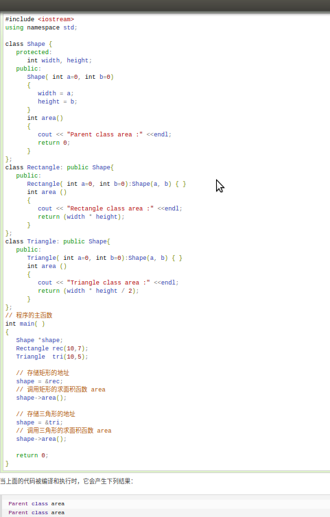
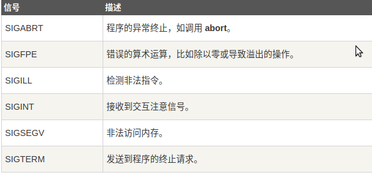

# C++小知识点
1. **\<cstdio>与<stdio.h>区别:**
   - stdio.h是C标准函数库中的头文件, stdio.h头文件将所有名字放在global namespace中.
   - cstdio是标准C++（STL）头文件, cstdio头文件将所有名字放在std namespace中.
2. **<>与" "区别:**
   - <>先去系统目录中找头文件，如果没有再到当前目录下找. 所以像标准的头文件 stdio.h和 stdlib.h等用这个方法.
   - " "首先在当前目录下寻找，如果找不到，再到系统目录中寻找. 这个用于include自定义的头文件，让系统优先使用当前目录中定义的.
3. **namespace介绍:**
   - C语言中只有一个全局作用域.
   > - C语言中所有的全局标识符/函数共享一个作用域, 
   > - 标识符之间可能发生冲突.

   - C++中引入namespace概念,即命名空间.
   > - 命名空间将全局作用域分成不同作用域.
   > - 不同命名空间中的标识符/函数可以同名而不发生冲突.
   > - 命名空间可以嵌套.
   > - 全局作用域也叫作默认命名空间.

   - 嵌套的命名空间:
   
   

   using指令: 可以使用using namespace 指令告诉编译器后续代码正在使用那个命名空间中的标识符/函数.
4. **继承:**
   - 继承允许我们依据另一个类来定义一个类,这使得创建和维护一个应用程序变得更容易,也达到了重用代码功能和提高效率的效果.
   - 当创建一个类时,不需要重新编写成员变量和成员函数,只需要指定新建的类继承一个已有的类即可.这个已有的类称为基类, 新建的类称为派生类.
   例: 
      单继承:`class derived-class: public/protected/private base-class`  
      多继承: `class derived-class: public/protected/private base-class, public/protected/private base-class1`
   - 继承有三种继承类型:public, protected, private. 我们通常使用public.
     公有继承(public): 当一个类派生自共有基类时,基类的公有成员也是派生类的公有成员,基类的保护成员也是派生类的保护成员,基类的私有成员不能直接被派生类访问,但是可以通过调用基类的公有和保护成员来访问.
     保护继承(protected): 当一个类派生自保护基类时, 基类的公有和保护成员将称为派生类的保护成员.
     私有继承(private): 当一个类派生自私有基类时, 基类的公有和保护成员将成为派生类的私有成员.
5. **访问控制和继承:**
   **在没有继承的情况下，protected和private相同.**
    
6. **重载运算符和重载函数:**  
   当您调用一个重载函数或重载运算符时，编译器通过您所使用的参数类型与定义中的参数类型进行对比,决定选用最合适的定义,选择最合适的重载函数或重载运算符的过程称为**重载决策**.
   - 重载函数: 在同一作用域内,可以声明几个功能类似的同名函数,但是这些函数的形参(个数或类型或顺序)必须不同.
   - 重载运算符: 可以重新定义或重载C++内置的大部分运算符.
      > 重载的运算符是带有特殊名称的函数,函数名是由关键字operator和其后要重载运算符符号构成的,与其他函数一样,重载运算符有一个返回类型和一个参数列表.例:`Box operator+(const Box& b)`

    
   - 上图例子中中的 if (p1 == p2) 语句，相当于对象p1调用函数“operator==”，把对象p2作为一个参数传递给该函数，从而实现了两个对象的比较。
7. **多态和虚函数:**
   
   - 上图中导致输出错误的原因是调用函数area()被编译器设置为基类中的版本,这就是所谓的**静态多态**或**静态链接**-函数调用在程序执行前就已经设置好了,故也叫**早绑定**.
  
   
   - 上图中输出正确结果原因是area()函数会在每个子类中具有不同的实现.这就是**多态**的一般使用方式.
   - 虚函数: 是在基类中使用关键字virtual声明的函数. 在派生类中重新定义基类中定义的虚函数时, 会告诉编译器不要静态链接到该函数, 这种操作称为**动态链接**或**后期绑定**.
   - 纯虚函数: 在基类中定义虚函数，以便在派生类中重新定义该函数更好地适用于对象，但是您在基类中又不能对虚函数给出有意义的实现，这个时候就会用到纯虚函数。
      > `virtual int area() = 0;` = 0 告诉编译器,函数没有主体, 是纯虚函数.
8. **数据抽象和数据封装:**
   - 数据抽象指只向外界提供关键信息,并隐藏实现细节.C++类为数据抽象提供了可能,其可以向外界提供用于操作的公有方法,外界实际上并不清楚类的内部实现.
   - 数据抽象和数据封装的好处:
     > 类的内部受到保护,不会因无意的用户级错误导致对象状态受损.
     > 类实现可能随着时间的推移而发生变化,以便对应不断变化的需求,或者应对那些要求不改变用户级代码的错误报告。
9. **预处理器:**
    - 预处理器是一些指令,指示编译器在实际编译之前所需完成的预处理.
    - 所有的预处理器指令都是以(#)开头,只有空格符可以出现在预处理器之前,预处理器指令不是C++语言,所以它们不会以分号(;)结尾.
      > `#include`指令用于把头文件包含到源文件中.
    - #define预处理指令用于创建符号常亮,该符号常量通常被称为**宏**.
      > 例: `#define PI 3.14159`
    - 参数宏:使用#define来定义一个带参数的宏.
      > 例: `#defone MIN(a,b) (a < b ? a : b)`
    - 条件编译: 可以用来有选择的对部分程序源代码进行编译.
      
10. **信号处理:**
    - 信号是由操作系统传给进程的中断,会提前终止一个程序,可以通过ctrl+c产生中断.
    - 下表所列信号可以在程序中捕获:
      
    - C++信号处理库提供signal函数来捕获突发/中断事件.
      > 例: `signal(SIGINT, signalHandler);`  //捕获到ctrl+c中断时执行signalHandler函数.
    - raise()函数:其可以生成突发/中断信号.
      > 例: `raise( SIGINT);` // 可以产生一个与ctrl+c效果相同的一个中断.
11. **异常处理:**
    - C++异常是指在程序运行时发生的特殊情况,比如尝试除以零操作.
    - C++异常处理涉及到三个关键字:
      > throw: 当出现问题时,程序会抛出一个异常.
      > catch: 用于捕获异常,可以捕获C++标准内置的异常(定义在\<exception>中)),也可以自定义异常.
      > try: try块中放置可能抛出异常的代码,try块中的代码被称为**保护代码**.
12. **动态内存:**
    - C++程序中的内存分为两部分:
      > - 栈: 在函数内部声明的所有变量都占用栈内存.
      > - 堆: 用于动态内存分配.
    - 很多时候,我们无法提前预知需要多少内存来存储某个定义变量中的特定信息,所需内存的大小需要在运行时才能确定,这时就需要分配堆中的内存,使用new和delete运算符.
      > 例: `int *array=new int [m];`  //动态分配,数组长度为 m
13. **模板:**
    - 人们需要编写多个形式和功能都相似的函数或类, 于是C++引人了**函数模板**和**类模板**, 编译器从函数模板和类模板可以自动生成多个函数和类，避免了程序员的重复劳动.
      例: ./template/template.c
14. **智能指针:**
    - 动态内存管理经常会出现两种问题: 一种是忘记释放内存, 会造成内存泄漏; 一种是尚有指针引用内存的情况下就释放了它,, 就会产生引用非法内存的指针.
    - 为了更加容易（更加安全）的使用动态内存, 引入了智能指针的概念. 智能指针的行为类似常规指针, 重要的区别是它负责自动释放所指向的对象.
    - 智能指针分类:
      > unique_ptr: 持有对对象的独有权, 即unique_ptr不共享它所管理的对象(两个unique_ptr不能指向一个对象).
      > shared_ptr: 共享所有权的智能指针，允许多个指针指向同一个对象.
      > weak_ptr: 不控制所指向对象生存期的智能指针，它指向一个由shared_ptr管理的对象，将一个weak_ptr绑定到一个shared_ptr不会改变shared_ptr的引用计数。一旦最后一个指向对象的shared_ptr被销毁，对象就会被释放，即使有weak_ptr指向对象，对象还是会被释放.