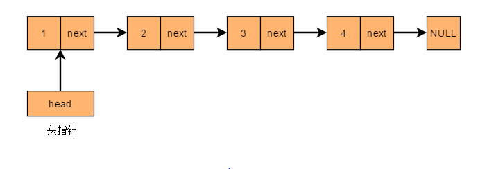

# 链表
- 数组,vector在内存中采用连续的存储方式, 也就是数据在内存中是连续存放的.
> 连续存储方式的缺点: 在开辟数组空间时需要保证内存有足够的连续内存才能保证内存分配.

- 为了解决上述问题, 产生了既能存储数据又能存储地址的数据单元称为单链表节点, 单链表节点分为两部分:
> 1. 数据域: 存储数据
> 2. 指针域: 存储后续节点的内存地址, 既指向下一个节点.
> 各个节点数据通过指针的方法串联起来, 构成链表, 如下图示, 其中的指针均为单向的, 因此称为单链表.

