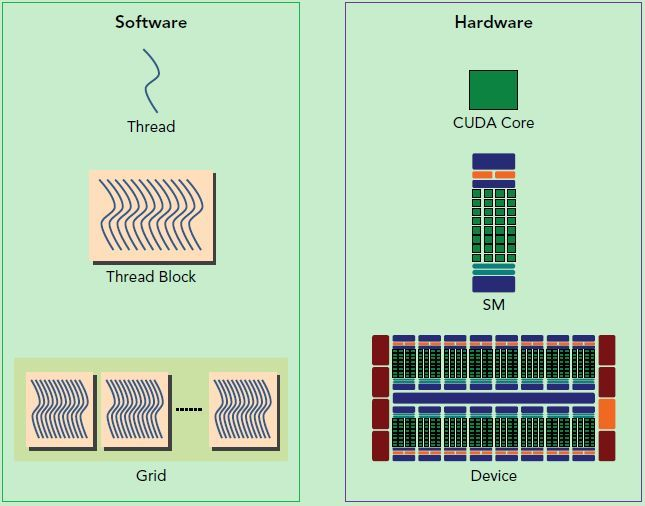
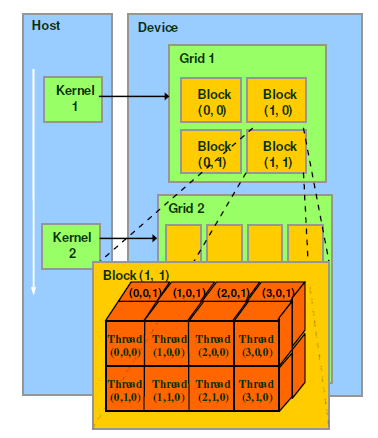

# Cuda[链接](https://www.cnblogs.com/1024incn/tag/CUDA/)
## Cuda硬件和软件结构
  
   
1. 硬件结构:  
* `SP(Streaming Processor)`:流处理器，是GPU最基本的处理单元，在fermi架构开始被叫做CUDA core.   
* `SM(Streaming MultiProcessor)`: 一个SM由多个CUDA core组成,**每个SM根据GPU架构不同有不同数量的CUDA core**,Pascal架构中一个SM有128个CUDA core, 还包括特殊运算单元(SFU)，共享内存(shared memory)，寄存器文件(Register File)和调度器(Warp Scheduler)等组成.  
2. 软件结构:  
  

* thread: 一个CUDA的并行程序会被以许多个thread来执行.  
* block: 数个thread会被群组成一个block，同一个block中的thread可以同步，也可以通过shared memory进行通信.  
* grid: 多个block则会再构成grid.  
* Warp[链接](https://www.cnblogs.com/1024incn/p/4541313.html): 逻辑上所有thread是并行的，但是从硬件的角度来说，实际上并不是所有的thread能够在同一时刻执行, 一个SP可以执行一个thread. warp是SM的基本执行单元，warp是调度和运行的基本单元，一个warp需要占用一个SM运行，多个warps需要轮流进入SM，由SM的硬件warp scheduler负责调度。一个warp包含32个并行thread，这32个thread执行于SMIT模式，也就是说所有thread执行同一条指令，并且每个thread会使用各自的data执行该指令. 一个warp中的线程必然在同一个block中，如果block所含线程数目不是warp大小的整数倍，那么多出的那些thread所在的warp中，会剩余一些inactive的thread，也就是说，即使凑不够warp整数倍的thread，硬件也会为warp凑足，只不过那些thread是inactive状态，需要注意的是，即使这部分thread是inactive的，也会消耗SM资源.  
* `__global__`是kernel函数，可从cpu调用，调用时用`<<< >>>`语法配置并行化参数。`__device__`是只能从一个gpu函数调用，不能从cpu调用.  