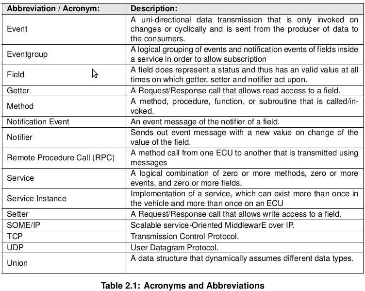
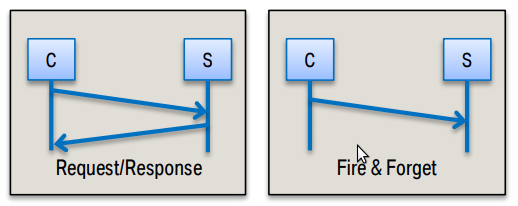
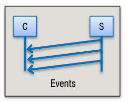
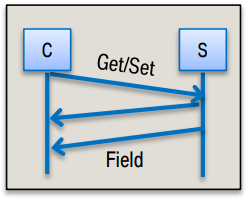
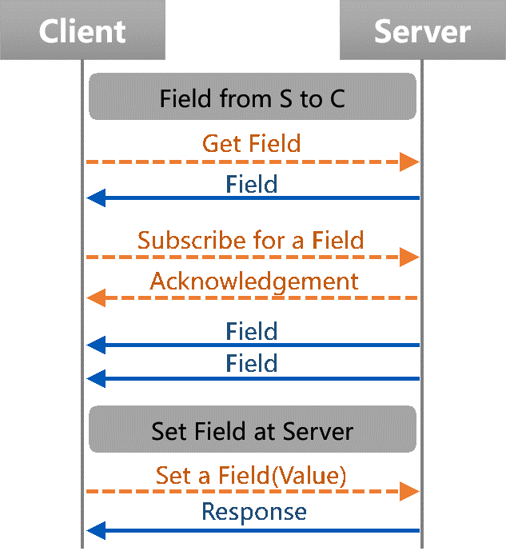
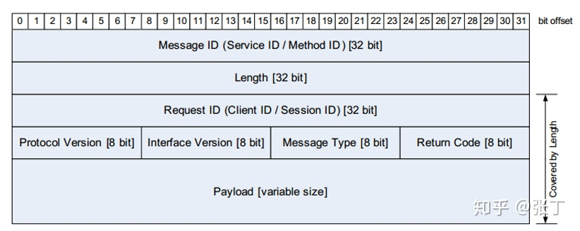

# SOA 
* SOA(Service-Oriented Architecture)，即面向服务的架构，是一种软件架构设计的模型和方法论。

## SOA 使用的必要性？
[汽车上为什么非要用SOA？](https://www.oktesla.cn/2020/01/36425.html)  
[浅析SOME/ IP协议，打开车载以太网的大门](https://zhuanlan.zhihu.com/p/148390311)

* 随着ADAS、无人驾驶等技术在汽车领域的不断发展，使用传统CAN总线，在通讯速率、带宽等方面，都已经不能满足设计需求。因此汽车以太网作为其基础技术之一，也越来越得到行业内的重视和认同。在车载以太网中，控制单元的交互是通过SOME/IP来实现的。SOME/IP，Scalable service-Oriented MiddlewarE over IP，是一种专用于汽车嵌入式的客户端/服务器通信机制，即运行于IP之上的可伸缩的面向服务的中间件，用于支持分布式应用软件，帮助分布式应用软件来传递信息的这么一套机制。与CAN总线相比，实现了从小平台到大平台的扩展，兼容更多的用户案例和通信节点，并且既能够应用到嵌入式AUTOSAR系统中，又可以应用于Linux、QNX或Android等操作系统中。

* SOA优点：汽车领域采用SOA架构的一个主要原因就是能够加快车辆与互联网的互联互通。
> 1. 能够将各种新功能灵活地与互联网集成，而无需通过信号到服务的转换；
> 2. 基于互联互通，能够大幅提升自动驾驶功能：便于实现高清地图的创建、更新及路线预测等功能，便于实现车辆信息的上传以及云端指令的下达；
> 3. 基于互联互通，快速提升系统与软件升级性能：有助于实现更高效的OBD及OTA软件升级，有助于实现各种远程诊断、预诊断等功能；
> 4. 基于互联互通，能够大幅提升影音娱乐功能的用户体验，能够实现更为便捷的联网功能，实现不同平台间的各种App共享等功能；
> 5. 更便于实现平台架构升级：通过SOA及SD的方式，能够有效降低架构升级带来的复杂度；

## SOME/IP [SOME/IP简介](https://zhuanlan.zhihu.com/p/48424110)
* **在以CAN总线为主的车载网络中，通信过程是面向信号的（除了诊断通信之外），这是一种根据发送者需求实现的通信过程，当发送者发现信号的值变化了，或者发送周期到了，就会发送信息，而不考虑接收者是否有需求。而SOME/IP则不同，它是在接收方有需求的时候才发送，这种方法的优点在于总线上不会出现过多不必要的数据，从而降低负载。**   

* 服务是SOME/IP的最核心概念。在一个服务中，定义了Server和Client两个角色：Server提供服务，Client调用服务。对于同一个服务，只能存在一个Server，但可以同时存在多个Client调用服务。一个Service由0~多个Event/Method/Field组成。与CAN相比，面向服务的通讯方式能够大大降低总线的负载率。  
    1. Method:
    > 请求/响应（Request/Response）通信: 客户端发送一条Request消息，该消息由服务端Response.  
    > 焚烧 & 忘记（Fire＆Forget）通信:客户端向服务器调用方法，无需服务器响应消息的请求称为fire＆forget.  
    

    2. Event: 触发式的从服务器发送到客户端的消息。Fire＆Forget方式。与CAN消息类似。  
    

    3. Field: 是Getter、Setter和Notifier的组合。类似于MOST上的属性。Getter是一个请求/回应调用，请求报文的payload为空，Field的值置于响应报文的payload中。同样Setter也是一个请求/回应调用，将要设置的Field的值置于请求报文的payload中，响应报文的payload也要放置Field设置的值。Notifier同Event类似，Field中的事件报文在Field值更新时会发送出来，但遵循事件发送规则。  
    
    

* SOME/IP数据的格式如下:  

## SOME/IP Service Discovery (SOME/IP-SD)
* SOME/IP-SD提供了两种动态发现服务的机制：
    > Offer Service: 由server向网络上的小伙伴告知它所提供的服务.  
    > Find ServiceL: 由client向别人请求可用的服务.  
* SOME/IP-SD可以被当作SOME/IP的一种特殊服务，client可以远程调用server提供的服务，或者订阅server发布的内容，那么client是怎么知道server提供哪些服务呢，就是通过SOME/IP-SD来实现服务发现过程的。它对SOME/IP-SD报文中的Payload进行了定义和实现。而Message ID字段则是固定的0xFF FF 81 00。
