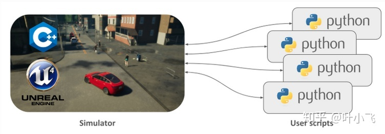

# Carla know how

## Carla 概况： [链接](https://zhuanlan.zhihu.com/p/338641593)
1. 介绍：Carla是一款开源的自动驾驶仿真器，它基本可以用来帮助训练自动驾驶的所有模块，包括感知系统，Localization, 规划系统等等.    
2. `Client-Server`的交互形式: Carla主要分为`Server`与`Client`两个模块，Server端用来建立这个仿真世界，而Client端则是由用户控制，用来调整、变化这个仿真世界.   
    * Server: Server端负责任何与仿真本身相关的事情：从3D渲染汽车、街道、建筑，传感器模型的构建，到物理计算等等。它就像一个造物主， 将整个世界建造出来，并且根据Client 的外来指令更新这个世界。它本身是基于UnrealEnigne做出的3D渲染.  
    * Client: 如果server构造了整个世界，那么这个世界不同时刻到底该如何运转（比如天气是什么样，有多少辆车在跑，速度是多少）则是由Client端控制的. 用户通过书写Python脚本（最新版本C++也可以）来向Server端输送指令指导世界的变化，Server根据用户的指令去执行. 另外，Client端也可以接受Server端的信息，譬如某个照相机拍到的路面图片.  

    
3. Carla 核心模块:   
    * Traffic Manager: 通过这个模块，用户可以定义N多不同车型、不同行为模式、不同速度的车辆在路上愉快地与你的自动驾驶汽车（Ego-Vehicle）一起玩耍.  
    * Sensors: Carla里面有各种各样模拟真实世界的传感器模型，包括相机、激光雷达、声波雷达、IMU、GNSS等等. 为了让仿真更接近真实世界，它里面的相机拍出的照片甚至还有畸变和动态模糊效果.  
    * Recorder：俗话说的好，不能复现的仿真不是好仿真。这个模块就是用来记录仿真每一个时刻（Step)的状态，可以用来回顾、复现等等.  
    * ROS bridge：这个模块可以让Carla与ROS还有Autoware交互，正是这个模块的存在使得在仿真里测试你的自动驾驶系统变得可能.  
    * Open Assest：这个模块可以允许你为仿真世界添加customized的物体库，比如你可以在默认的汽车蓝图里再加一个真实世界不存在、外形酷炫的小飞汽车，用来给Client端调用.  

## Carla安装 ： [链接](https://zhuanlan.zhihu.com/p/338927297)

## 