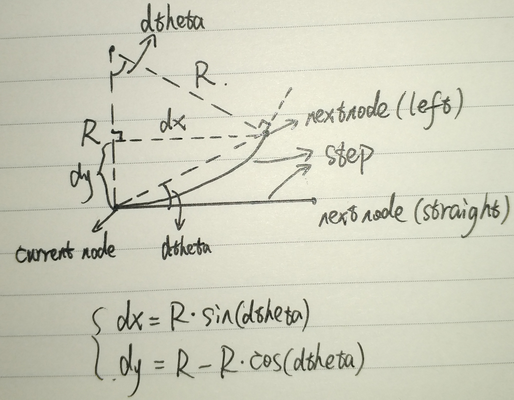

# Hybrid_A*
## A*与Hybrid_A*
* [A*算法](https://scm_mos.gitlab.io/motion-planner/a-star/)：是一种静态路网中求解最短路最有效的方法,是把启发式方法（`heuristic approaches`），和常规方法如`Dijsktra`算法结合在一起的算法,启发式方法经常给出一个近似解而不是保证最佳解。然而，尽管`A star`基于无法保证最佳解，`A star`却能保证找到一条最短路径.  
* A*与Hybrid_A*区别在于Hybrid_A*考虑了车辆的约束条件(转向盘转角限制).  

1. `A*`算法节点定义：
  ```cpp
    struct AstarNode
    {
        NodeStatus status = NodeStatus::None;  // node status
        double x;                              // x
        double y;                              // y
        double theta;                          // theta
        double gc = 0;                         // actual cost：表示从初始结点到任意结点`n`的移动代价
        double hc = 0;                         // heuristic cost：表示从结点`n`到目标点的启发式评估代价
        bool is_back;                          // true if the current direction of the vehicle is back
        AstarNode * parent = nullptr;          // parent node
        double cost() const { return gc + hc; }
    };
  ```
  * `openlist`:待搜索点集合。  
  * `goallist/closedlist`：输出轨迹点集合。  
2. 将`costmap`变换为`std::vector<std::vector<std::vector<AstarNode>>> nodes(height, width, theta_size)`, 其中`theta_size`为角度颗粒度.  
3. `createTransitionTable`:根据角度分辨率创建运动转移`table`.    
  

4. `openlist(std::priority_queue<AstarNode *, std::vector<AstarNode *>, NodeComparison>)`：存储待搜索的Node，其中根据`gc+hc`值进行降序排列，每次搜索扩展时取`current_node = openlist.top()`进行搜索，根据`current_node`的偏航角信息分别计算`forward_straight`、`forward_left`、`forward_right`、`backward_straight`、`backward_left`、`backward_right`6个方向可能的`next_node`然后`push`到`openlist`中，每次循环的`current_node`存储在`goallist/closedlist`中作为最终的输出轨迹，持续循环搜索直至到达`goal_node`结束。 
5. 上图中$step = R * dtheta$为每次移动距离, 其中$R$为最小转弯半径，$dtheta$为角度分辨率，$step$和$dtheta$越小就越能保证轨迹的平滑。  
6. 其中`next_node->gc`为`current_node->gc`与`move_cost`之和，`move_cost`为`step`乘权重（前进和后退有不同的权重）,$hc$为权重乘`current_node`与`goal_node`的欧式距离。  