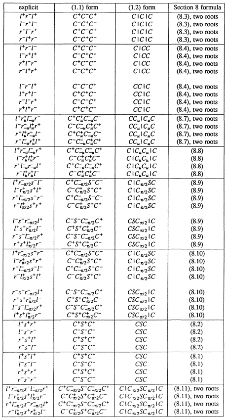
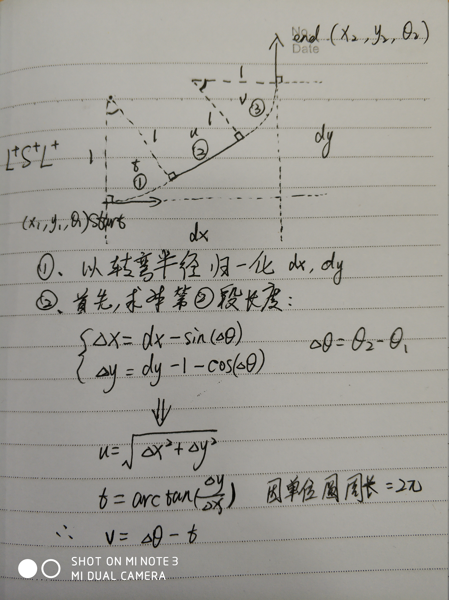

# RS(reeds and shepp)曲线

* Reeds-Shepp Car: a car that can go both forward and backward with a constrained turning radius.   
* Reeds-Shepp curves can find a shortest path in the plane with specified initial and final points and directions and with the further  constraint that at each point the radius of curvature.  

* The 48 curves of Reeds and Shepp:  
    

48种Base Word分成5大类(`CCC`,`CSC`,`CCCC`,`CCSC`,`CCSCC`)，9个小类(每个类别可由一组公式求解)，其中`C`代表左或右方向, `S`代表直行方向.  

    
