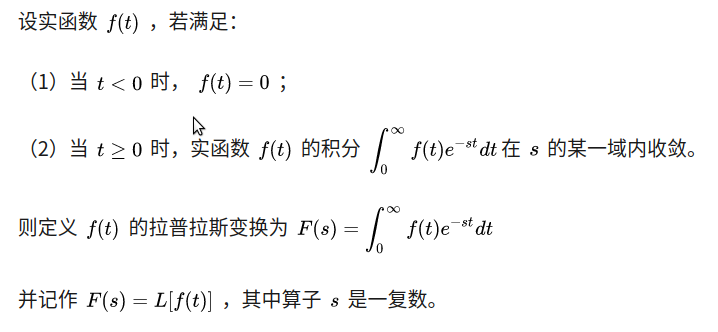
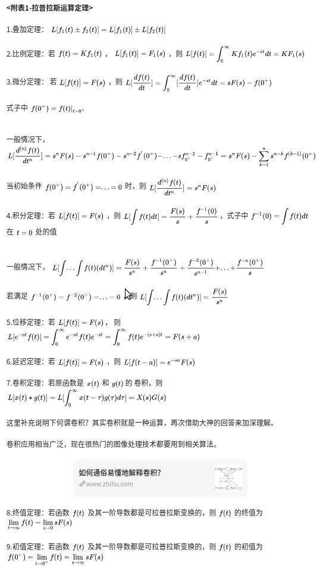
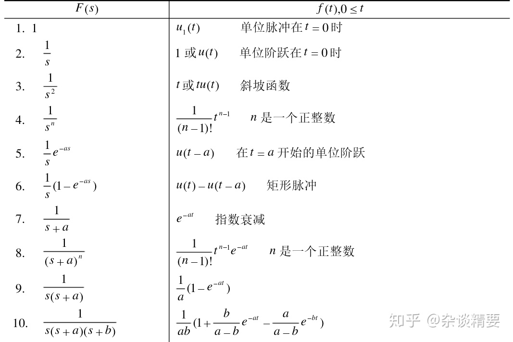
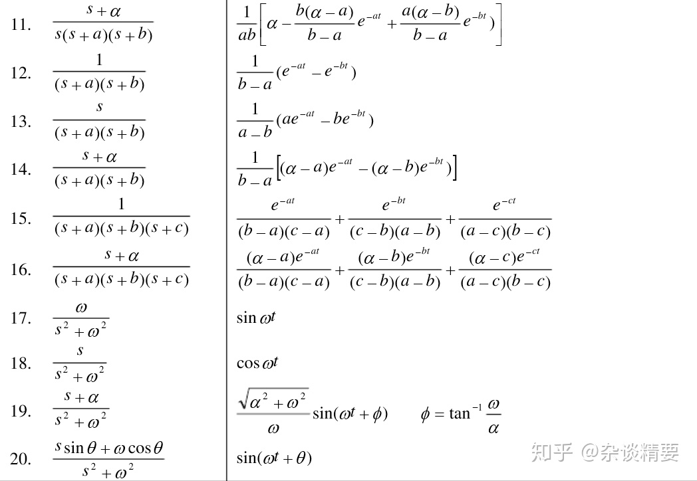
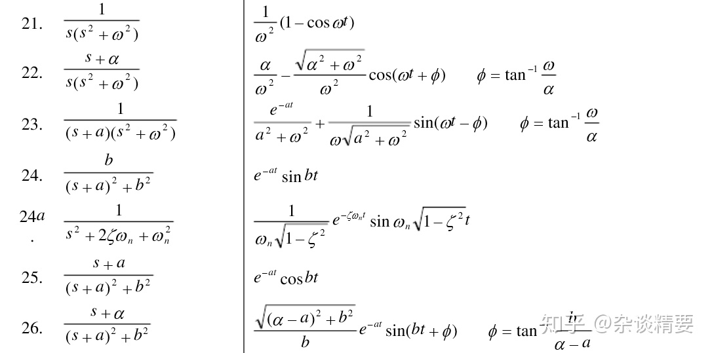
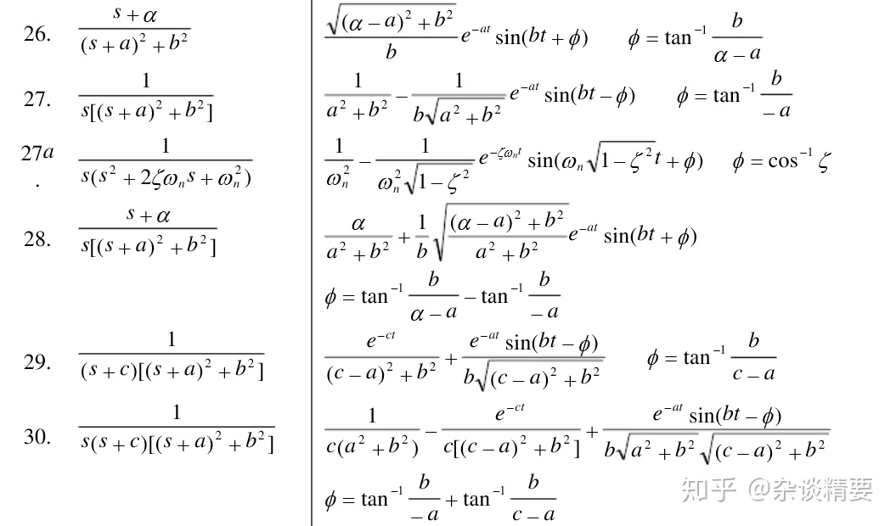

# 控制理论

## 频率域研究法
1. 拉普拉斯变换[链接](https://zhuanlan.zhihu.com/p/146769901)  
* **可以将微分方程转化为代数方程进行运算，使得求解大为简化.**
* **在控制中常被用作将状态方程转换为传递函数.**

* 利用拉普拉斯变换和反变换来实现时间域和频率域之间的转换，拉普拉斯变换定义：  
   

* 拉普拉斯运算定理：  
   

* 拉普拉斯变换表：  
   
   
   
  

## 连续函数离散化：
**对于线性连续系统使用了拉普拉斯变换后得到传递函数，大大简化了系统的描述复杂度. 在离散系统中，参考连续系统的微分算子($s$)和拉普拉斯变换，引进预测算子($z$)实现相应的离散变换.**
* 双线性转换（梯形准则）:只要把模拟传递函数中出现的每一个$s$都用$\frac{2(z-1)}{T_(z+1)}$代替就得到了相应的$z$域的离散近似.
* $z$变换是分析线性离散系统的数学工具，它在离散系统分析中的作用和拉普拉斯变换在连续系统中的作用是一样的.

## 动态补偿  
**如果仅通过P(比例增益)环节不能获得满足动态响应的设计要求，就必须对动态过程进行修正或补偿.**
* 超前补偿(lead compensation): 近似于PD控制器，它主要通过降低上升时间和减少超调来加速系统的响应.
* 滞后补偿(lag compensation): 近似于PI控制器，主要用来改善系统的稳态误差. 
* 超前滞后校正(notch compensation): 主要用来提升低阻尼模型的稳定性.

## 前馈
**前馈用来改进系统对指令的响应速度.**