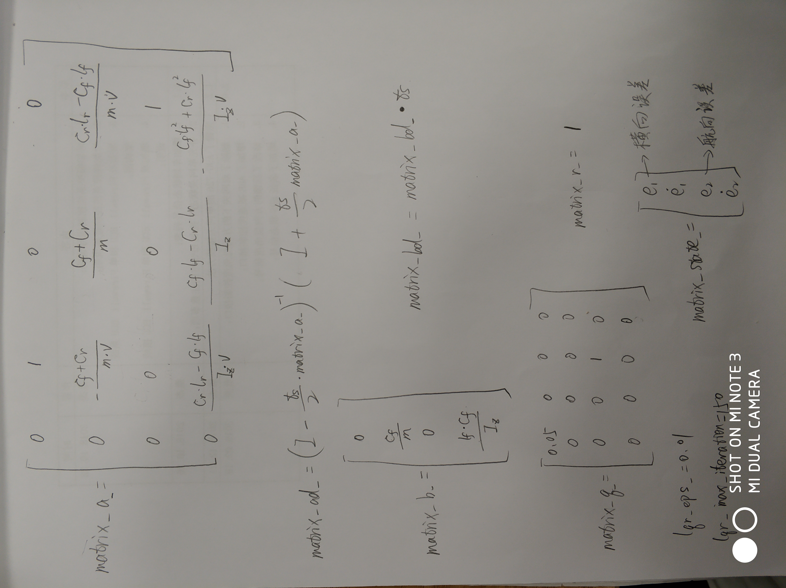
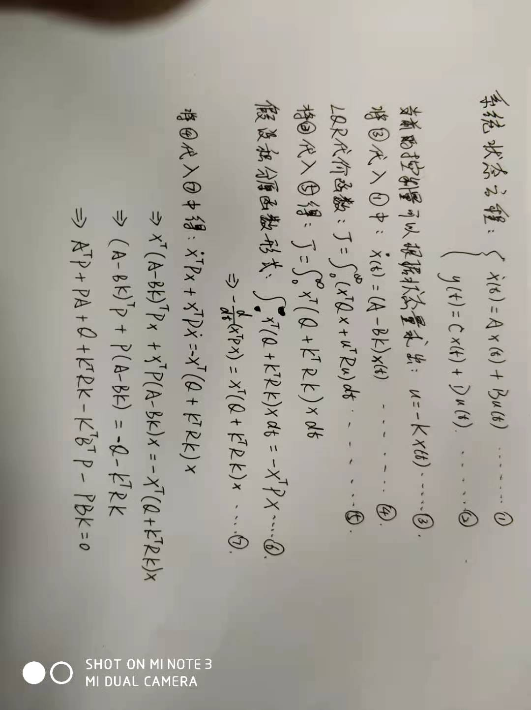

# LQR(apollo)

## LQR(linear quadratic regulator):
**[LQR横向控制1](https://blog.csdn.net/zhouyy858/article/details/107606500#commentBox)**  
**[LQR横向控制2](https://mp.weixin.qq.com/s?__biz=MzU5ODMzNjgyOQ==&mid=2247484188&idx=1&sn=ff1ceeb167dba714c34bd783e29c5e3e&chksm=fe44f74ec9337e580dce97221c68420294af323bbad59521d254a661a6a9a2f25b8bd619fb85&mpshare=1&scene=24&srcid=0813688oA8i6nGBI1xrD64fg&sharer_sharetime=1597308597093&sharer_shareid=87c63c66f42a4150bca9a3d2a69b5061&exportkey=A%2FtDWpvREGfMGHBbn8yXZ1Q%3D&pass_ticket=iKiIC0PPXpaN2GsRRpg3wB0jFaUVyftIpZkZjdAjmdcyoxOoEQpqAIY9G7W3lSkx&wx_header=0#rd)**  
**[LQR横向控制3](https://zhuanlan.zhihu.com/p/110239637)**  

**车辆动力学公式推导：**  
  
  
  

**车辆动力学公式：**  
  

**若一系统动态可以用一组线性微分方程表示，且其成本为二次泛函，这类问题成为二次(LQ)问题，此类问题的解即为线性二次调节器(LQR)。**

1. 车辆的横向控制期望根据路径跟踪偏差能够快速、稳定的趋于零，并且保持平衡，同时前轮转角控制输入又尽可能小，这就是一个典型的目标优化控制问题。
2. 优化问题的目标函数可以表示为跟踪过程累计的跟踪误差和累计的控制输入的权重和：   
   $J = \int(x^TQx + u^TRu)dt$        
   其中：$Q$为半正定的状态权重矩阵，$R$为正定的控制权重矩阵.
3. 其中$J$是一个关于状态变量$x$和控制输入$u$的二次型目标函数，对它的求解是典型的LQR最优控制问题，求解最小目标函数$J$.
4. $Q$矩阵元素变大意味着希望跟踪偏差能够快速趋进于零，$J = \int(x^TQx)dt$ 表示跟踪过程路径偏差的累积大小.
   $R$矩阵元素变大意味着希望控制输入能够尽可能小. $J = \int(u^TRu)dt$ 表示跟踪过程控制能量的损耗.
5. 求解过程：  
    -    
    - [Algebraic Riccati equation](https://en.wikipedia.org/wiki/Algebraic_Riccati_equation)
    - 通过一系列推到得到代数黎卡提方程：$P = A^T_dPA_d - A^T_dPB_d(R + B_dPB_d)^{-1}B^T_dPA_d + Q$ , 其中$A_d$和$B_d$是离散后的$A$和$B$矩阵.
    - 迭代代数黎卡提方程求出$P$
    - 当两次$P$的差值足够小时(通过tolerance:The numerical tolerance for solving Discrete
         Algebraic Riccati equation (DARE) 和 max_num_iteration:The maximum iterations for solving ARE)作为限制来快速求得最优解，计算反馈矩阵$K = (R + B^TPB)^{-1}(B^TPA)$
    - 根据$K$求出最优控制量$u = -Kx$
    - 通过一个前馈控制输入量$u_{ff}$，解决曲线行驶时的稳态误差，前馈控制考虑了路径的曲率及车辆的转向不足特性。
6. 状态空间系统的离散化:
   * 离散化原因：离散化实际上是在尽可能的保存连续空间信息的情况下，把连续空间的问题转换为离散空间的描述，使得计算机能够更好地处理。
   * s域用于分析模拟控制器也就是连续空间，而z域用于分析数字控制器，也就是离散空间。  
   * 双线性变换： 一种求等效于s域传递函数的z域传递函数的方法是把s近似为z的函数：$s \approx \frac{2(z-1)}{T_(z+1)}$
      > 命名为双线性变换是因为它用两个s域的线性函数的比值来逼近z，即$z = \frac{e^{sT} / 2}{e^{-sT} / 2}$  
      > $e^{sT}$的泰勒级数为： $z = 1 + sT + \frac{sT}{2!} + ...$, 将泰勒级数前两项代入上式得：$z \approx \frac{1 + sT/2}{1 - sT/2}$  
 * 由上式可以求得状态变量$A$的离散化$A_d = \frac{I + AT/2}{I - AT/2}$

## 数学基础：
### 二次型[链接](https://www.zhihu.com/question/38902714)
1. 二次型：n个变量的二次齐次(每项都是二次的)多项式。

### 矩阵正定性[链接](https://zhuanlan.zhihu.com/p/44860862)：
1. 正定矩阵：给定一个大小为 $n×n$ 的**实对称矩阵** $A$ ，若对于任意长度为 $n$ 的非零向量 $x$ ，有 **$x^TAx > 0$** 恒成立，则矩阵 $A$ 是一个正定矩阵。
2. 半正定矩阵：给定一个大小为 $n×n$ 的**实对称矩阵** $A$ ，若对于任意长度为 $n$ 的非零向量 $x$ ，有 **$x^TAx \geq 0$** 恒成立，则矩阵 $A$ 是一个半正定矩阵。

### discrete-time Algebraic Riccati equation:
* 代数黎卡提方程与黎卡提方程的区别：
离散时间代数黎卡提方程(DARE)可以由矩阵值的黎卡提微分方程的非时变解来验证。