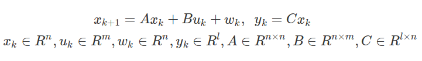
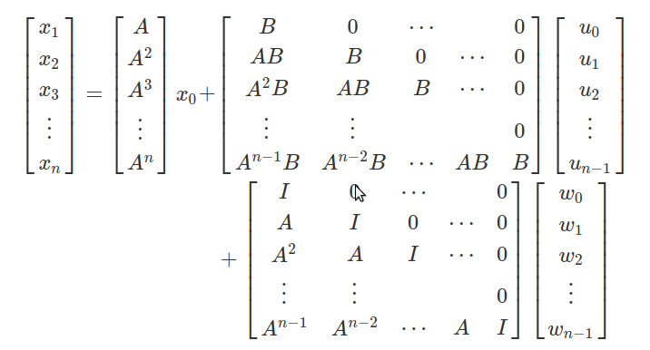
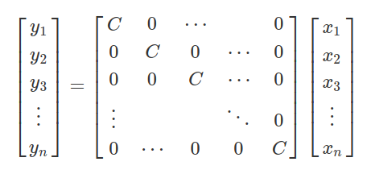

# MPC(Model Predictive Control)

## 预测模型
**车辆动力学模型推导：**  
  
  
 

**Path Coordinates模型:**[模型推倒](https://blog.csdn.net/u013914471/article/details/83018664)  

**状态方程离散化:**   
   

* 目标系统离散状态方程：  
  

**基于车辆模模型的预测** [基于车辆模型的预测及二次规划代价函数](https://zhuanlan.zhihu.com/p/72738458)  
* 基于Path Coordinates模型可以得到未来$n$时刻状态：  
    
   
则： $X_{ex} = A_{ex}x_t + B_{ex}U_{ex} + W_{ex}$ 和 $Y_{ex} = C_{ex}X_{ex}$  

## 滚动优化
* 创建评估函数，评估函数通常使用以下二次型： $J = (Y - Y_{ref})^TQ(Y - Y_{ref}) + (U - U_{ref})^TR(U - U_{ref})$       
* 则： $J = (C_{ex}(A_{ex}x_t + B_{ex}U_{ex} + W_{ex}) - Y_{ref})^TQ(C_{ex}(A_{ex}x_t + B_{ex}U_{ex} + W_{ex}) - Y_{ref}) + (U - U_{ref})^TR(U - U_{ref})$  

* 通常求解二次优化问题时将损失函数转换为：$J = U^THU + f^TU$ 然后使用相应的工具或函数库进行求解二次最优化问题  
* 则$J = U_{ex}(B^T_{ex}C^T_{ex}QC_{ex}B_{ex} + R)U + 2((C_{ex}(A_{ex}x_t + W_{ex}) - Y_{ref})^TQC_{ex}B_{ex} - U^T_{ref}R)U_{ex}$

