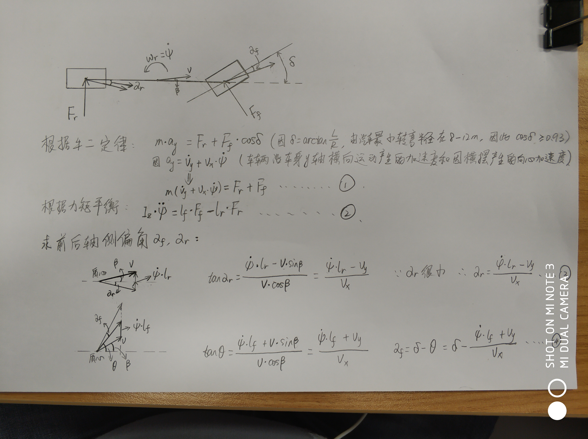
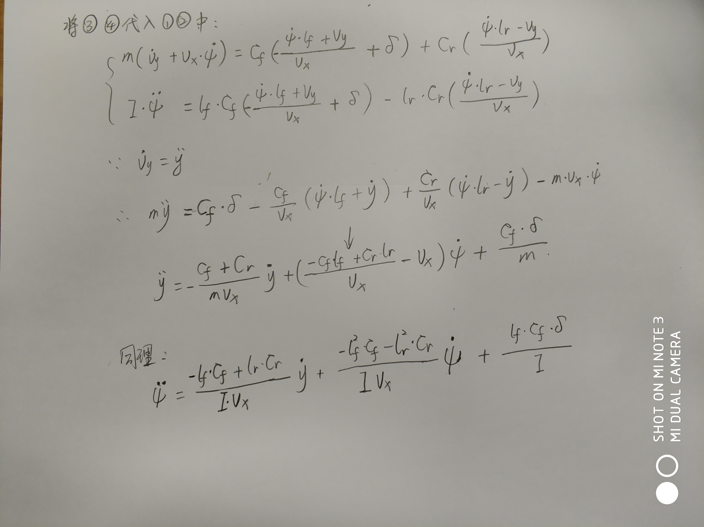
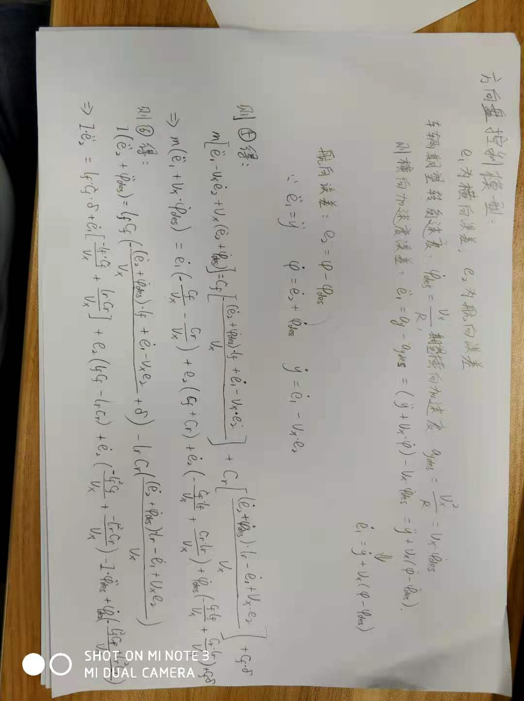
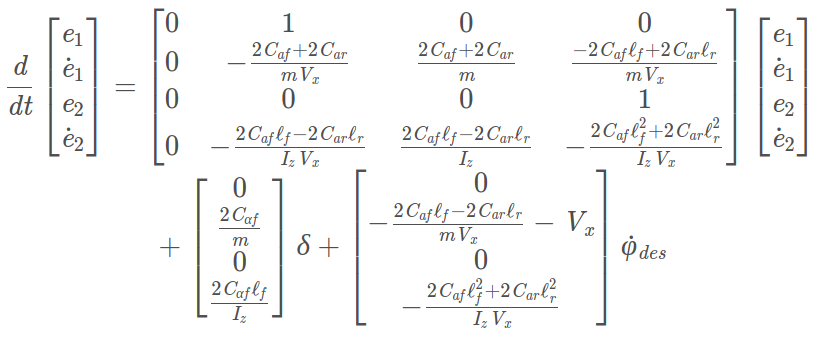
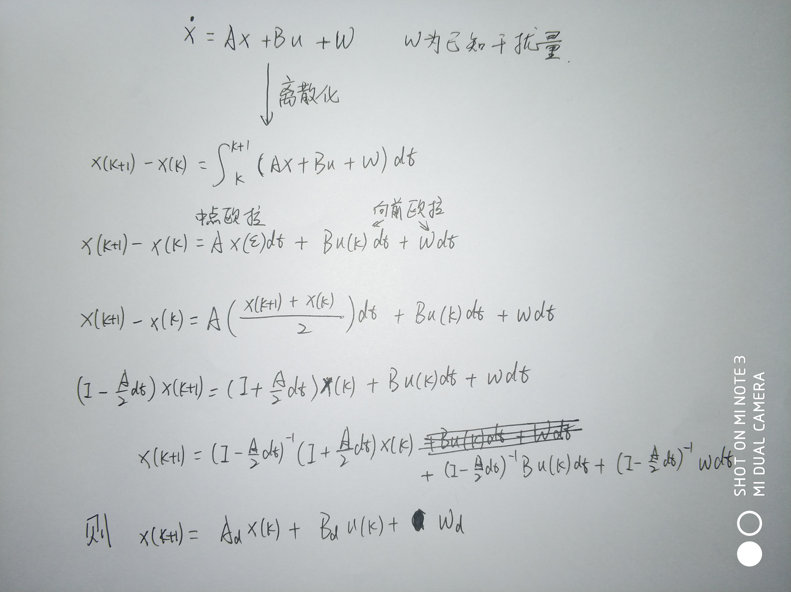
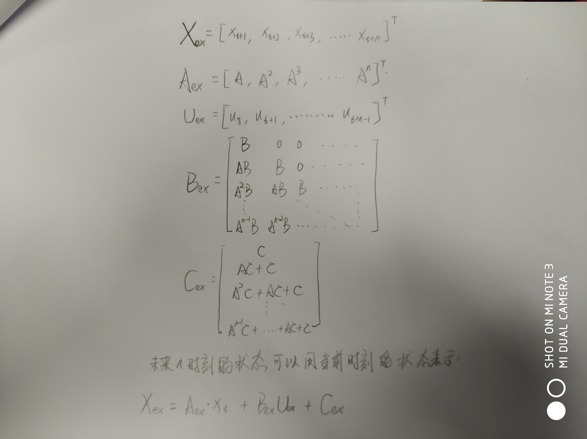

# MPC(Model Predictive Control)

## 预测模型
**车辆动力学模型推导：**  
  
  
 

**Path Coordinates模型:**[模型推倒](https://blog.csdn.net/u013914471/article/details/83018664)  

**状态方程离散化:**   
  

**基于车辆模模型的预测** [基于车辆模型的预测及二次规划代价函数](https://zhuanlan.zhihu.com/p/72738458)  
* 基于Path Coordinates模型可以得到未来$n$时刻状态：  
  

* 假设未来$n$时刻车速恒定：  
  

