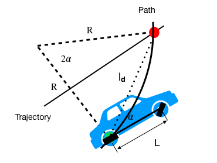
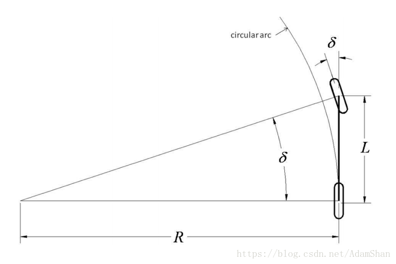
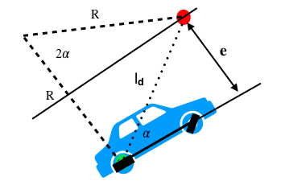

# Pure pursuit(autoware)

[参考1](https://medium.com/@dingyan7361/three-methods-of-vehicle-lateral-control-pure-pursuit-stanley-and-mpc-db8cc1d32081)  
[参考2](https://blog.csdn.net/AdamShan/article/details/80555174)

  

根据上图车辆当前位置和路点位置的三角坐标关系得到：  
&emsp;&emsp;&emsp;&emsp;&emsp;&emsp;$l_d = 2*R*sin(α)$  
&emsp;&emsp;&emsp;&emsp;&emsp;&emsp;&emsp;&emsp;⇓  
&emsp;&emsp;&emsp;&emsp;&emsp;&emsp;$\frac{1}{R} = k = \frac{(2*sin(α))}{l_d}$  

    
  
由阿克曼转向关系：$tan(\delta) = \frac{L}{R}$可得： ---------------------(1)  
  
&emsp;&emsp;&emsp;&emsp;&emsp;&emsp;$\delta = arctan(\frac{2*L*sin(α)}{l_d})$ ---------------------(2)  
  
    
  
由上图可得: $sin(α) = \frac{e}{l_d}$ ---------------------(3)  
综上(2)和(3)可重写$k$得： $k = \frac{2}{l_d^2}*e$, &emsp;其中$k$为曲率，$\delta$为前轮转角，$L$为车辆轴距，$e$为车辆当前姿态和目标路点在横向上的误差，$l_d$为前视距离且$l_d \approx a*v_x$. 

最后， 通过(1)可得$\delta = arctan(\frac{L}{R}) = arctan(L*k)$

