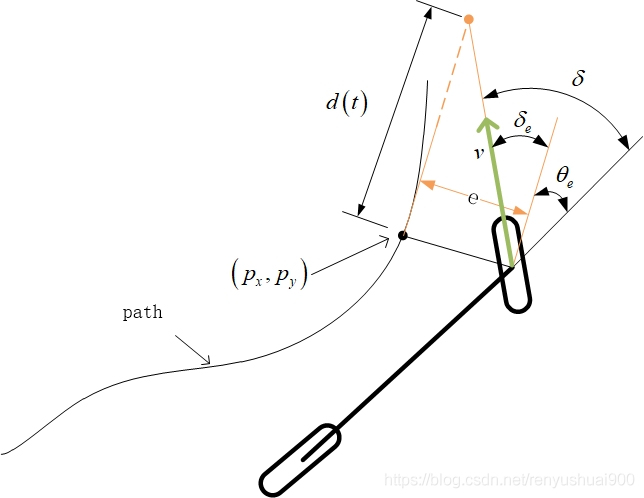

# Stanley
[参考1](https://blog.csdn.net/renyushuai900/article/details/98460758)  
[参考2](https://medium.com/@dingyan7361/three-methods-of-vehicle-lateral-control-pure-pursuit-stanley-and-mpc-db8cc1d32081)  

  

* Stanley是根据轨迹目标点与车辆位置航向角差值、轨迹目标点与车辆位置的横向跟踪误差来进行跟踪.  
* 横向偏差$\delta_e$和航向偏差$\delta_{\theta_e}$，车辆转角的控制变量$\delta = \delta_e + \delta_{\theta_e}$.  
&emsp;&emsp;&emsp;&emsp;&emsp;&emsp;$\delta_e = arctan\frac{e(t)}{d(t)} = arctan\frac{k*e(t)}{v(t)}$,其中$d(t)$与车速相关，最后用车速$v(t)$，增益参数$k$表示.
* 基本转角控制率为： $\delta = \theta_e + arctan(\frac{k*e}{v})$或者$\delta = k_{gain1}*\theta_e + arctan(\frac{k_{gain2}*e}{k_{gain3} + v})$， 其中$\theta_e$为轨迹目标点与车辆位置航向角差值，$e$为轨迹目标点与车辆位置的横向跟踪误差.  
