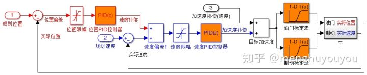

# 纵向控制-PID(apollo)

[纵向PID控制](https://zhuanlan.zhihu.com/p/110002970)  
## 代码流程：
1. 初始化：加载配置参数（纵向控制参数（PID）、是否使能leadlag校正、车辆参数、标定表、preview window）
2. 输入定位、底盘CAN信息和规划轨迹
3. 计算纵向偏差并进行限幅处理（`clamp`）后输入位置环PID控制器，leadlag校正进行补偿（如果使能）。
4. 计算速度偏差进行限幅处理（`clamp`）后输入速度环PID
5. 计算斜坡加速度坡度补偿 = $g*sin(pitch)$并对该值滤波处理
6. 加速度 = 速度环输出 +　斜坡加速度坡度补偿 ＋ 预览加速度
7. 计算剩余路径规划路点数，当车速和加速度都过小时，判定车辆停止
      

