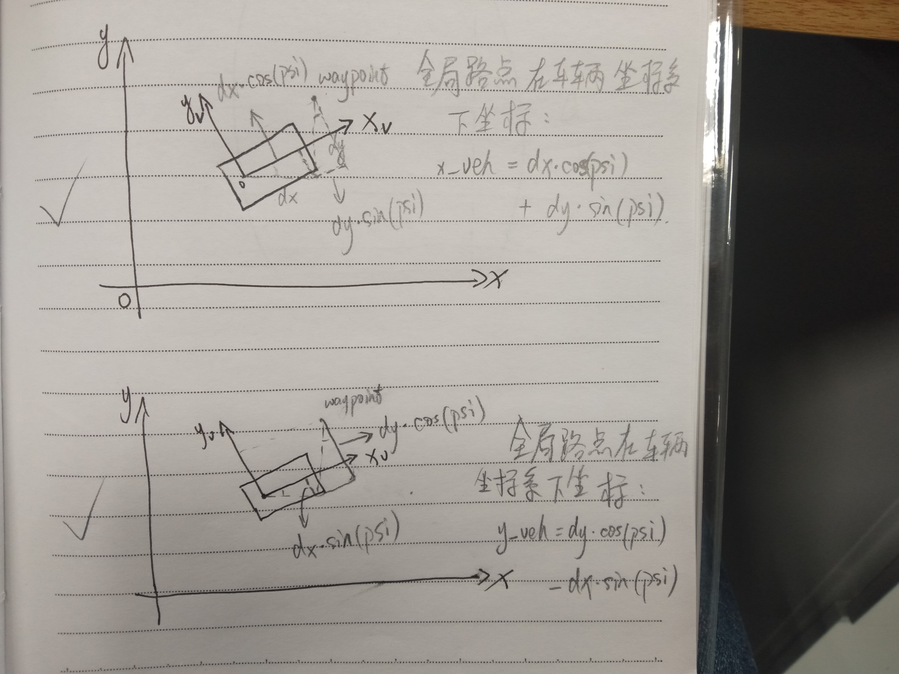

# MPC(Model Predictive Control)

## **MPC对比PID:** 
	传统PID控制器虽然易于实现, 但是并不是一种优化控制, 而且PID在实际的车辆控制中存在延迟问题. 相比较而言MPC则是一类追求短时间间隔内最优化控制的理论, 并将延迟考虑到车辆模型中了, 从而避免了延迟问题.

## **MPC介绍:**
* MPC是一种致力于将更长时间跨度, 甚至于无穷时间的最优化控制问题, 分解为若干个更短时间跨度, 或者有限时间跨度的最优化控制问题, 并且在一定程度上仍然追求最优解.  
* 指一类算法，周期性基于当帧测量信息在线求解一个有限时间开环优化问题，并将结果的前部分控制序列作用于被控对象.  

* **MPC由如下三个要素组成:**  
1. 预测模型: 预测模型能够在短时间内很好的预测系统状态的变化.  
	> 基于车辆运动学模型, 在给定一个控制指令情况下, 就可以根据预测模型和运动规律计算出一定时间后的车辆的状态(x,y,v...), 这个预测模型计算出来的状态只是理论上车辆的可能状态. 如下图所示, 红色线就是根据运动学模型得到的预测状态.     
	

2. 在线滚动优化: 由于预测模型得到的结果与实际仍然存在偏差, 所以采用滚动优化找到每个时刻下的局部最优解, 通常情况会设计一个目标(损失)函数并将其转化为二次规划问题进而找到最优解.     
	> * 滚动优化是求取最优控制解，基于约束，使某一或某些性能指标达到最优实现控制作用.   
	> * 通过目标函数(损失函数)优化预测模型输出的预测轨迹, 损失函数设计的越完善合理其输出的结果也就越符合人的需求. 损失函数值越大表示规划轨迹和预测轨迹的重合度越低, 因此最终的目标是最小化损失函数.    

3. 反馈校正: 到下一个时间点根据新的状态重新进行预测和优化.    
	> 如下图所示MPC示意图, 可见MPC本质还是一种反馈控制.    
	

## **MPC算法流程:**
	变量含义 px:当前定位x轴方向坐标, py:当前定位y轴方向坐标, psi:当前偏航角, v:当前车速, cte:当前车辆期望与实际位置间的位置差值, epsi:当前车辆期望和实际偏航角间的角度差值, delta:车轮转角, a:加速度.    
### 预测模型:
	车辆具有多个自由度且运动姿态耦合性强, 受力复杂, 故是一个非线性多自由度运动缸体, 为了简化模型, 因此将模型简化为线性模型.   
1. 将局部路点转换到车辆坐标系下:  
	  
	由上图可得坐标变换的两个重要公式:  
	$x_veh = dx*cos(psi) + dy*sin(psi)$  
	$y_veh = dy*cos(psi) - dx*sin(psi)$

2. 预测路径多项式拟合:  
	采用多项式拟合得到一定时间后的车辆轨迹, 选用三次多项式进行拟合(三阶多项式拟合可以满足大部分的情况,阶数过小会导致拟合不足风险, 阶数过高会出现过拟合或者不必要的复杂度).  

	`auto K = polyfit(waypoints_xs, waypoints_ys, ORDER);`  
	其中K为多项式的参数即多项式拟合曲线为: $f = K[3]px_n^3 + K[2]*px_n^2 + K[1]*px_n + K[0]$  

    **当$px = 0$时则可以得到cte, 即$cte = K[0]$. epsi为可以通过拟合曲线的斜率得到, 即 $f' = 3.0 * K[3] * px0 * px0 + 2.0 * K[2] * px0 + K[1]$, 当$px = 0$ 就可以得到期望与当前实际位置的斜率, 则$epsi = arctan(K[1])$.**     
	上式中多项式拟合中涉及到了矩阵QR分解相关, 即将一个矩阵分解成一个正交矩阵(Q)和一个上三角矩阵(R), 本案例中采用householder变换进行QR分解.  

3. 车辆运动学模型:   
	> 	$px_{n+1} = px_n + v*cos(psi_n)*dt$  
		$py_{n+1} = py_n + v*sin(psi_n)*dt$  
		$psi_{n+1} = psi_n + \frac {v_t}{Lf}*delta*dt$  
		$v_{n+1} = v_n + a*dt$  
		$cte_{n+1} = cte_n + v*sin(psi)*dt$  
		$epsi_{n+1} = epsi_n + \frac {v_t}{Lf}*delta*dt$  

	**因为车辆坐标系是随着车一直在改变的, 因此$px_n$, $py_n$, $psi_n$始终是为0的. 可得:**   
	>	$px_{n+1} = 0 + v*1*dt$    
		$py_{n+1} = 0$  
		$psi_{n+1} = 0 + \frac {v_t}{Lf}*delta*dt$  
		$v_{n+1} = v_n + a*dt$  
		$cte_{n+1} = cte_n + v*sin(psi)*dt$  
		$epsi_{n+1} = epsi_n + \frac {v_t}{Lf}*delta*dt$  
		该六项参数组成state矩阵.  

### 滚动优化: 
	基于车辆的约束(转角和加速度约束), 构建目标(损失)函数并将其转化为二次规划问题进而找到最优解.  
1. 车辆系统的约束(constraints):  
	1). 约束范围:  
	> a. 转角范围: -35°~35°  
	  b. 加速度范围: -1g~1g  

	2). 约束的作用:  
	> a. 确保结果的可行性.  
	  b. 二次规划最优算法需要反复递归计算结果, 而状态空间范围越小, 计算时间也会提升.  

2. 目标(损失)函数: 目标是求得使目标函数最小值的解, 当然越重要的参数权重越大, 反之依然, 甚至不约束.  
	基于以下几点进行目标函数设计:  
	> 	1). 横向偏移误差，指实际轨迹点与参考轨迹点间的距离.  
  		2). 速度误差，指实际速度与期望速度的差.  
		3). 角度偏移量，指航向角与参考值的差异.  
		4). 刹车/油门调节量，目的是为了保证刹车/油门变化的平稳性.  
		5). 航向角变化率，相邻时间间隔的航向角变化量.  
		6). 加速度变化量，描述相邻时间间隔，加速度的变化快慢.  

    **目标函数: $cost = A*cte^2 + B*epsi^2 + C*(v-v_max)^2 + D*delta^2 + E*a^2 + F*(a_{n+1}-a_n)^2 + G*(delta_{n+1}-delta_n)^2$**  
    上式中平方是为了统一符号, 权重差异不能过分悬殊, 各个参量没有进行归一化处理, 则尤其注意权重间的平衡.   

3. 完成车辆模型约束设置和目标函数构建后只需要调用CppAD::ipopt求解器进行二次规划求最优解.

### 反馈校正:
	根据反馈的车辆状态进行新一轮的预测控制.

## **非线性优化问题:**  
	非线性优化问题是针对一个非线性函数求最值的问题. MPC中对非线性最优话问题的求解方法是通过CppAD::ipopt求解器求得, 即(Interior Point OPTimizer), 是用于大规模非线性优化的软件包.  

## 参考资料:  
[无人驾驶汽车系统入门（十）——基于运动学模型的模型预测控](https://blog.csdn.net/AdamShan/article/details/79083755)  
[基于模型预测（MPC）的无人驾驶汽车轨迹跟踪](https://blog.csdn.net/qq_40870689/article/details/87971282)  
[自动驾驶——模型预测控制（MPC）理解与实践](https://blog.csdn.net/qq_42258099/article/details/95353986)  
[到底什么是非线性规划？](https://blog.csdn.net/wzheng92/article/details/80110963)  
[using the Model Predictive Control method to drive a car around a virtual track.](https://github.com/mithi/mpc)  