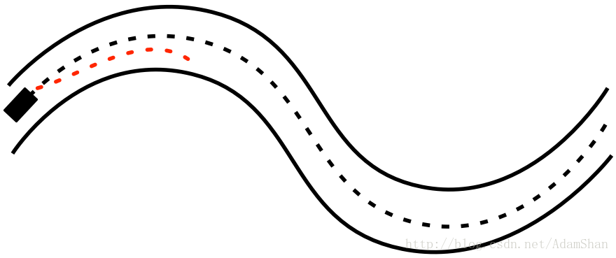
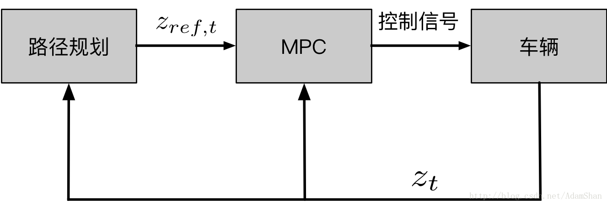

# MPC(Model Predictive Control)
参考资料[链接1](https://blog.csdn.net/AdamShan/article/details/79083755)
- **MPC对比PID:** 
	> 传统PID控制器虽然易于实现, 但是并不是一种优化控制, 而且PID在实际的车辆控制中存在延迟问题. 相比较而言MPC则是一类追求短时间间隔内最优化控制的理论, 并将延迟考虑到车辆模型中了, 从而避免了延迟问题.

- **MPC介绍:**
	> * MPC是一种致力于将更长时间跨度, 甚至于无穷时间的最优化控制问题, 分解为若干个更短时间跨度, 或者有限时间跨度的最优化控制问题, 并且在一定程度上仍然追求最优解. 
	> * MPC由如下三个要素组成: 
	>   1. 预测模型: 预测模型能够在短时间内很好的预测系统状态的变化.
		基于车辆运动学模型, 在给定一个控制指令情况下, 就可以根据预测模型和运动规律计算出一定时间后的车辆的状态(x,y,v...), 这个预测模型计算出来的状态只是理论上车辆的可能状态. 如下图所示, 红色线就是根据运动学模型得到的预测状态.
	
	>   2. 在线滚动优化: 通过某种最优控制算法来优化未来一段时间的控制输入, 使得在这种控制输入下预测模型的输出与参考值的差距最小.
		通过损失函数(目标函数)优化预测模型输出的预测轨迹, 损失函数设计的越完善合理其输出的结果也就越符合人的需求. 损失函数值越大表示规划轨迹和预测轨迹的重合度越低, 因此最终的目标是最小化损失函数.
	>   3. 反馈校正: 到下一个时间点根据新的状态重新进行预测和优化.
		如下图所示MPC示意图, 可见MPC本质还是一种反馈控制.
	

	