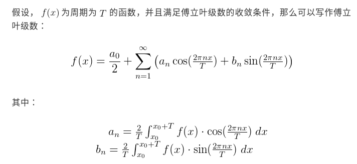
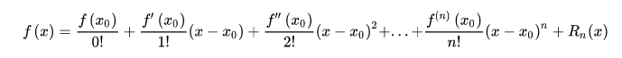

# 数学
## 傅立叶变换  
* **满足一定要求的函数可以分解为多个$sin$和$cos$函数之和.**  
   

## 泰勒公式  
* **将非线性函数线性话的一种方法.**
   

## 拉普拉斯变换 [链接](https://zhuanlan.zhihu.com/p/146769901)  
* **可以将微分方程转化为代数方程进行运算，使得求解大为简化.**
* **在控制中常被用作将状态方程转换为传递函数.**

* 拉普拉斯变换定义：  
   

* 拉普拉斯运算定理：  
   

* 拉普拉斯变换表：  
   
   
   
   

